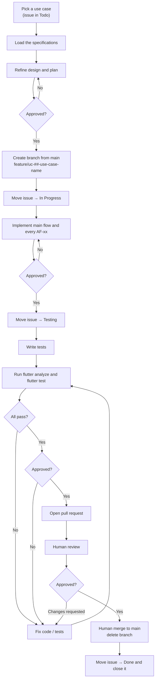

# Development Workflow Document — Fortuna UI

## 1. Purpose

This document defines **how a use case moves from backlog to merged** — the branch, the issue status
transitions, the testing gate, and the pull request. It is the standard every contributor, human or
agent, follows so that each use case in the
[Use Case Specification Document](Use%20Case%20Specification%20Document.md) is delivered the same
way.

It complements the [Testing Specification Document](Testing%20Specification%20Document.md), which
defines *how* the tests themselves are written; this document defines *when* they happen in the
delivery flow.

This is the same process the [Fortuna API](https://github.com/artur-rios/fortuna-api) and the
[Heimdall API](https://github.com/artur-rios/heimdall-api) follow — deliberately, so that one
process serves every repository. Its operational form, written as instructions to an implementer,
is [`initial/Workflow.md`](../initial/Workflow.md); where the two could be read as disagreeing, that
document governs and this one is corrected to match.

> **One use case = one branch = one issue = one pull request.**

## 2. Workflow at a glance



The four `Approved?` decisions are the gates of §6. They are where an implementer stops and asks.

## 3. Issue status lifecycle

| Order | Status | Set when |
| --- | --- | --- |
| 1 | **Todo** | The use case has not been started (default). |
| 2 | **In Progress** | A branch has been created and implementation has begun. |
| 3 | **Testing** | Implementation is finished; tests are being written, run, and fixed until green. |
| 4 | **Done** | The pull request has been reviewed and merged; the issue is then **closed**. |

An issue only ever moves **forward** during normal flow. If review requests changes, work continues
on the same branch, still linked to the same issue, until the suite passes again and the pull
request is re-reviewed.

## 4. Step-by-step

### Step 0 — Load the specifications and refine the plan

Before any code, read the specifics for this use case rather than working from memory: its entry in
the [Use Case Specification Document](Use%20Case%20Specification%20Document.md) including every
`AF-xx`; the `FR-xx` requirements traced to it in the
[System Requirements Document](System%20Requirements%20Document.md); the
[Testing Specification Document](Testing%20Specification%20Document.md); and the
[Technology Stack Document](Technology%20Stack%20Document.md).

Because this repository is a client, one further source is usually needed: **the API endpoints the
use case calls**, in the Fortuna API's own specification documents. Read the contract rather than
guessing at it, and never assume a field the generated client does not carry.

Then turn that into a concrete design for this codebase — screens, routes, providers, repositories,
validators and widgets; which generated calls each flow makes; and how every alternative flow maps
to what the user actually sees — and capture it as a written, test-first implementation plan.

### Step 1 — Branch from `main`

Every use case is implemented on its own branch, created from an up-to-date `main`:

```bash
git switch main
git pull
git switch -c feature/uc-01-configure-the-instance-and-mode
```

**Branch naming pattern:**

```
feature/uc-##-use-case-name
```

`##` is the zero-padded use case number; `use-case-name` is its name in lower-case kebab-case.

| Use case | Branch |
| --- | --- |
| UC-01: Configure the Instance and Mode | `feature/uc-01-configure-the-instance-and-mode` |
| UC-19: Record a Transaction | `feature/uc-19-record-a-transaction` |
| UC-37: Drill Into a Chart Aggregation | `feature/uc-37-drill-into-a-chart-aggregation` |

### Step 2 — Move the issue to **In Progress**

As soon as the branch exists and work starts, set the issue's status to **In Progress**. This is the
only status change made without asking.

### Step 3 — Implement

Implement the use case's main flow **and every alternative flow**, following the repository's
established patterns and the architecture in the
[System Requirements Document](System%20Requirements%20Document.md). All commits go on the branch,
and the implementation and its tests grow together.

Two rules bind every change in this repository:

- **No monetary value ever becomes a `double`** — not in a model, a widget, an intermediate
  expression, or a test fixture.
- **Never hand-edit generated code.** A wrong API client means a wrong OpenAPI document; a wrong
  binding means a wrong C header. Both are fixed at the source and regenerated.

### Step 4 — Move the issue to **Testing**

When the implementation is code-complete, set the issue's status to **Testing**. This signals that
the work is done and the testing gate is now in progress.

### Step 5 — Test until green

Following the [Testing Specification Document](Testing%20Specification%20Document.md):

1. Write the tests for the main flow and each applicable `AF-xx` alternative flow.
2. Run them:

   ```bash
   flutter analyze
   flutter test
   ```

3. **Fix** any failure — in the implementation or in the tests. An analyzer failure is a failure.
4. **Re-run**, and repeat until everything passes.

Integration tests are run separately, per the Testing Specification. A use case does not leave the
Testing stage until the full suite is green.

### Step 6 — Open a pull request

With everything passing, push the branch and open a pull request into `main`. The description
references the use case and its issue, so the merge closes it.

### Step 7 — Human review and merge

- The pull request is **reviewed by a human**. Requested changes are addressed on the same branch —
  back to Step 5 whenever code changes, so the suite stays green.
- Once approved, a human **merges** the pull request.
- The **branch is deleted** after the merge.

> Review and merge are **human actions**. An agent may prepare and push the pull request, but must
> not self-approve or merge it — except under the authorized batch run of §7.

### Step 8 — Close the issue

After the merge, set the issue's status to **Done** and **close** it.

## 5. Two mechanism use cases

UC-02 (reaching the core over the configured transport) and UC-46 (guarding a route) are mechanisms
rather than screens, and they are delivered the same way as any other use case — one branch, one
issue, one pull request. Their tests differ: they are exercised through the features built on them
rather than through a screen of their own, which the Testing Specification accounts for.

## 6. The approval gates

The work is reviewed before it advances. Four gates apply, and they are not batched:

| Gate | Before | What is shown |
| --- | --- | --- |
| 1 | Writing any code | The refined design and the implementation plan |
| 2 | Moving the issue to Testing | What was built, flow by flow |
| 3 | Opening the pull request | The passing suite, read rather than asserted |
| 4 | Moving the issue to Done | That the merge happened and the branch is gone |

The only status change made unattended is `Todo → In Progress`. When pausing at a gate, summarize
what the stage completed, state what comes next, and wait for a clear go-ahead.

## 7. Authorized batch runs

When several use cases are delivered in one unattended run, the gates would stop the run at every
use case, which defeats the point of batching them. For a **batch run only**, an agent may merge its
own pull requests, subject to all of the following:

- **The batch was authorized up front.** A human agreed to the specific use cases, in order, and was
  told explicitly that the agent would merge, close the issues and delete the branches. A general
  instruction to work autonomously is not this authorization.
- **The invariant still holds.** One use case = one branch = one issue = one pull request. Use cases
  are never batched into a shared branch or pull request, so the run stays reviewable afterwards.
- **The testing gate is unchanged.** The full suite is run and read for every use case. A merge on
  an unread or failing suite is never permitted.
- **No protection is bypassed.** No administrative override merge, no self-approval to satisfy a
  required review, no force-push, and no disabling or filtering of a test to make the suite green.
- **A failure stops the whole run.** A red suite, a merge conflict, an ambiguous specification, or a
  requirement that does not exist ends the batch. Already-merged use cases stay merged; the failing
  branch and its pull request are left in place as evidence.

Outside an authorized batch run, Step 7 applies as written: a human reviews and a human merges.

## 8. Definition of Done

A use case is done only when **all** of the following hold:

- [ ] Implemented on a `feature/uc-##-use-case-name` branch created from `main`.
- [ ] Main flow and every alternative flow from the specification are implemented, each with the
      interface behavior the specification defines for it.
- [ ] Unit tests cover each provider, repository, validator and formatter — main plus applicable
      `AF-xx`.
- [ ] Widget tests cover each screen the use case adds or changes, including its loading, empty and
      failed states.
- [ ] Integration tests cover the end-to-end flow where the Testing Specification calls for one.
- [ ] `flutter analyze` is clean and `flutter test` is green, and line coverage holds at or above
      the floor.
- [ ] No monetary value is represented as a `double` anywhere in the change.
- [ ] Neither the generated API client nor the generated FFI bindings were hand-edited.
- [ ] A pull request was merged to `main` — reviewed by a human, or merged by an agent under an
      authorized batch run (§7).
- [ ] The branch was deleted.
- [ ] The issue is in **Done** and closed.

## 9. References

- [`initial/Workflow.md`](../initial/Workflow.md) — the operational form of this process.
- [Use Case Specification Document](Use%20Case%20Specification%20Document.md) — the use case definitions and their flows.
- [Testing Specification Document](Testing%20Specification%20Document.md) — how the tests are written.
- [System Requirements Document](System%20Requirements%20Document.md) — functional and non-functional requirements.
- [Technology Stack Document](Technology%20Stack%20Document.md) — technologies and versions used.
- [Operations & Infrastructure Document](Operations%20%26%20Infrastructure%20Document.md) — the repository layout, generation pipelines and CI this workflow runs against.
