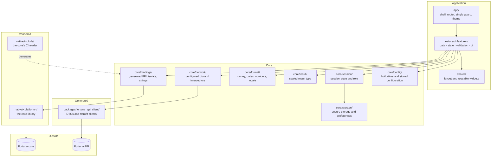

# Operations & Infrastructure Document — Fortuna UI

## 1. Introduction

### 1.1 Purpose

This document captures **cross-cutting platform concerns** for **Fortuna UI** that fall outside the
business domain modeled in the [Vision Document](Vision%20Document.md),
[System Requirements Document](System%20Requirements%20Document.md) and
[Use Case Specification Document](Use%20Case%20Specification%20Document.md).

These are functional capabilities of the *platform* rather than the domain, so they are documented
here to keep the domain documents focused while still tracking the work formally. The specific
technologies and versions this platform is built on are defined once in the
[Technology Stack Document](Technology%20Stack%20Document.md) and referenced from here rather than
duplicated.

Platform requirements carry their own identifier space, `IR-xx`, so they never collide with the
domain's `FR-<AREA>-xx`.

### 1.2 Scope

- The technical foundation: repository layout, the application's internal structure, and the
  scaffolding every feature is built on.
- The two code generation pipelines and the drift checks that keep them honest.
- Configuration: what is supplied at build time, what at run time, and what is never in either.
- Logging and observability, and what is deliberately never recorded.
- Environments and how they differ.
- Build, packaging and delivery for each of the four targets.

---

## 2. Technical Foundation

### 2.1 Overview

Fortuna UI is a single Flutter application with **no server component of its own**. Structurally it
is one package plus one generated package: the application in `lib/`, and the generated API client
in `packages/fortuna_api_client/`. The native library that desktop offline mode calls is produced by
the [Fortuna API](https://github.com/artur-rios/fortuna-api) and vendored here as a binary and a
header — it is not built in this repository.

The foundation this document specifies is what every use case is built on and what none of them
should have to establish: the folder structure, the app shell and its router, the single route
guard, the session and configuration providers, the result type, the money type and its formatting,
the storage wrappers, the two transports behind one repository seam, the localization setup, the
test scaffolding, and CI.

### 2.2 Solution Architecture



The dotted edge is the one that matters most operationally: the bindings are **generated from the
vendored header**, and the header is vendored from the API repository. Neither is written by hand,
and CI proves both.

### 2.3 Repository Layout

```
fortuna-ui/
├── .github/workflows/
│   ├── ci.yml                       analyze + test on every push and pull request
│   ├── build.yml                    per-target artifacts
│   └── check-generated.yml          regenerate client and bindings; fail on drift
├── api/
│   └── fortuna.json                 the API's OpenAPI document, copied from fortuna-api
├── native/
│   ├── include/fortuna_ffi.h        the core's C header, vendored verbatim
│   ├── windows/fortuna_ffi.dll      the core library for Windows
│   └── linux/libfortuna_ffi.so      the core library for Linux
├── packages/
│   └── fortuna_api_client/          generated: DTOs and retrofit clients
├── lib/
│   ├── app/                         shell, router, the single guard, theme
│   ├── core/
│   │   ├── bindings/                generated FFI bindings, worker isolate, string handling
│   │   ├── config/                  build-time and stored configuration
│   │   ├── format/                  money, number, date and currency formatting
│   │   ├── network/                 the configured dio instance and its interceptors
│   │   ├── result/                  the sealed result type every repository returns
│   │   ├── session/                 session state, role and restoration
│   │   └── storage/                 secure storage and preferences wrappers
│   ├── features/<feature>/
│   │   ├── data/                    repository interface and one implementation per transport
│   │   ├── state/                   providers, notifiers
│   │   ├── validation/              form validators
│   │   └── ui/                      screens and feature-local widgets
│   ├── l10n/                        ARB files for en-US, en-GB, en-150, pt-BR
│   ├── shared/                      layout and reusable widgets
│   └── main.dart
├── test/                            mirrors lib/ exactly
├── integration_test/                complete journeys
├── tool/
│   ├── generate_api_client.dart     the HTTP generation pipeline
│   └── generate_bindings.dart       the FFI generation pipeline
├── packaging/
│   ├── windows/                     installer definition and portable archive layout
│   └── linux/                       installer definition
├── android/ · linux/ · windows/ · web/
├── analysis_options.yaml
├── ffigen.yaml
├── swagger_parser.yaml
├── pubspec.yaml · pubspec.lock
└── docs/
    ├── initial/
    └── requirements/
```

There is no `ios/` and no `macos/` folder, and their absence is deliberate rather than pending.

### 2.4 Code Generation Pipelines

Two pipelines, each a single command, each rerun by CI and compared against what is committed.

**The API client.**

```bash
dart run tool/generate_api_client.dart
```

Runs `swagger_parser` over `api/fortuna.json`, then `build_runner` inside the generated package to
emit the `.g.dart` bodies, then `dart format` over the package — because the generators' own line
breaking differs from what a repository-root format would produce, and a difference there would fail
the drift check for no real reason.

`api/fortuna.json` is **copied from the Fortuna API repository**, where it is generated during that
project's own build. It is not authored here, and a change to it is a deliberate act of taking a new
API version.

**The FFI bindings.**

```bash
dart run tool/generate_bindings.dart
```

Runs `ffigen` over `native/include/fortuna_ffi.h`, which is vendored verbatim from the API
repository, then formats the output. CI diffs the vendored header against the published one, so a
header change surfaces as a build failure rather than as a runtime crash.

Both pipelines are deterministic: running one twice over unchanged input produces byte-identical
output, which is what makes the drift check meaningful.

### 2.5 Platform Requirements

| ID | Requirement |
| --- | --- |
| IR-01 | The repository shall follow the layout of §2.3, with tests mirroring `lib/` exactly. |
| IR-02 | The application shall be organized by feature, each feature owning its own data, state, validation and UI, and depending on `core` rather than on another feature. |
| IR-03 | The application shall expose one central route guard, and every route shall pass it regardless of how it was reached. |
| IR-04 | The application shall provide a single sealed result type that every repository returns, so that a failure is a value rather than an exception. |
| IR-05 | The application shall provide one money type carrying an exact decimal and its currency, and shall expose no conversion from it to a floating-point type. |
| IR-06 | The application shall provide locale-aware formatting for numbers, dates and currency, covering `en-US`, `en-GB`, `en-150` and `pt-BR`, with no hard-coded formatting anywhere else. |
| IR-07 | The application shall provide secure storage and preference wrappers, and the token shall be writable only through the secure one. |
| IR-08 | The application shall provide one configured HTTP client instance, carrying the bearer-token interceptor, base address and timeouts. |
| IR-09 | The application shall generate its API client from `api/fortuna.json` by a single command, and shall commit the result unmodified. |
| IR-10 | The application shall generate its FFI bindings from `native/include/fortuna_ffi.h` by a single command, and shall commit the result unmodified. |
| IR-11 | The build shall fail when the vendored C header differs from the version published by the API. |
| IR-12 | CI shall regenerate both the API client and the bindings and fail on any difference from what is committed. |
| IR-13 | Static analysis shall fail the build when `dart:ffi` is imported outside the bindings layer. |
| IR-14 | Static analysis shall fail the build when a monetary value is converted to or from a floating-point type. |
| IR-15 | Every FFI call shall be dispatched to a worker isolate, and every string the core returns shall be released, including on failure paths. |
| IR-16 | Configuration shall be supplied at build time by `--dart-define`, with no secret compiled into the artifact. |
| IR-17 | The application shall emit no log from a release build, and no log at any time shall carry a credential, a token, personal data or a financial figure. |
| IR-18 | The application shall include no analytics, telemetry, crash reporting or any third-party component that observes use. |
| IR-19 | CI shall run `flutter analyze` and `flutter test` on every push and pull request, and shall fail on either. |
| IR-20 | CI shall build every target — web, Windows, Linux and Android — and publish the resulting artifacts. |
| IR-21 | The desktop packages shall include the Flutter application, the Fortuna core native library and the SQLite database file, and shall work with nothing else installed. |
| IR-22 | The web image shall serve the built application as static files and shall carry no application secret. |

---

## 3. Configuration

Configuration reaches the application two ways, and the split is deliberate: **what the build
decides** versus **what the user decides**.

| Concern | Mechanism | Notes |
| --- | --- | --- |
| API base address | `--dart-define FORTUNA_API_BASE_URL` | The default instance for this build. Absent in a desktop offline build. |
| Google client identifier | `--dart-define FORTUNA_GOOGLE_CLIENT_ID` | Public by nature; not a secret. Absent where Google sign-in is not offered. |
| Transport selection | `--dart-define FORTUNA_TRANSPORT` | `http` or `ffi`. Decides which repository implementations are wired. |
| Database path, offline builds | `--dart-define FORTUNA_DB_PATH`, defaulting beside the executable | So a portable installation keeps its database with itself rather than in a user profile. |
| Instance address, self-hosted | Stored locally, entered by the user (UC-01) | Overrides the build-time address where present. |
| Theme, locale, display currency | Stored locally as preferences (UC-13) | Never a token, never a credential. |
| Session token | Platform secure storage only | Never a `--dart-define`, never a preference, never a file this application writes. |

**No secret is ever compiled into an artifact.** A Flutter build is distributed to users, and
anything inside it is readable — which is why the token is obtained at run time and the only
compiled-in values are addresses and public identifiers.

A build with no `FORTUNA_API_BASE_URL` and no stored address presents the setup screen rather than
failing (UC-01).

---

## 4. Logging & Observability

| Concern | Approach |
| --- | --- |
| Log format | Dart's `developer.log`, structured, **debug builds only** |
| Destination | The developer console. Nothing is written to a file, and nothing is transmitted anywhere. |
| Release builds | Emit no log at all |
| Never logged | Credentials, tokens, recovery codes, personal data, monetary values, record contents, API payloads carrying any of these |
| Crash reporting | **None.** No Sentry, no Crashlytics, no equivalent |
| Analytics | **None.** No third-party component observes use |

This is a deliberate consequence of `BR-34` and `BR-39`: the people who self-host Fortuna do so
precisely so that nobody else sees their financial history, and a diagnostic channel is a channel.
The cost is real — a crash on a user's machine produces no report — and it is accepted rather than
worked around.

**Server-side observability is the API's.** A shared instance is scraped by **Prometheus** and ships
its logs to **Loki**, both of which run against the API and its host, not against this application.
The same discipline applies there: those logs carry operational facts, never record contents. What
this application contributes to that picture is nothing at all, by design — and the instance health
an administrator reads through UC-45 comes from the API's own health surface.

---

## 5. Environments

| Environment | Purpose | Differences |
| --- | --- | --- |
| **Local** | Development | Points at a locally running API. Debug build, logs enabled, hot reload. |
| **Staging** | Verifying a build before release | Points at the staging API. Release build, so what is tested is what ships. |
| **Production** | The published application | Points at the production API. |
| **Desktop offline** | A self-contained installation | No API address at all; the FFI transport and a local database. Otherwise identical. |

**The only difference between local, staging and production is the API address.** No feature is
enabled in one and not another, no code path branches on environment, and there is no "staging mode"
inside the application — which is what keeps staging a genuine rehearsal rather than a different
program.

**No domain is registered yet.** The web deployment's hostname is therefore not recorded here; it is
a deferred decision, and the only thing that depends on it is the reverse proxy's routing rule and
the certificate it obtains.

---

## 6. Build & Delivery

### 6.1 Continuous integration

Three workflows, mirroring the ones the sibling repositories use:

| Workflow | Runs | Does |
| --- | --- | --- |
| `ci.yml` | Every push and pull request | `flutter analyze` and `flutter test`, and fails on either. The gate for merging. |
| `check-generated.yml` | Every push and pull request | Regenerates the API client and the FFI bindings, diffs the vendored header against the API's published one, and fails on any difference. |
| `build.yml` | On a tag, and on demand | Builds all four targets and publishes the artifacts. |

### 6.2 Packaging per target

| Target | Artifact | Contents |
| --- | --- | --- |
| **Web** | A Docker image | The static build served by a minimal web server. No application secret is baked in. |
| **Windows** | An `.exe` installer **and** a portable `.zip` | The application, the Fortuna core `.dll`, and the SQLite database file. |
| **Linux** | An installer | The application, the Fortuna core `.so`, and the SQLite database file. |
| **Android** | An `.apk` | The application alone. Connected mode only. |

The desktop packages are the substantial ones: they carry the core library and the database, which
is what lets desktop offline mode work with no network, no server and nothing else installed
(`IR-21`). The portable archive keeps its database beside the executable, so that copying the folder
copies the installation.

### 6.3 Web deployment

The web image runs on a **VPS under Docker**, behind **Traefik** as the reverse proxy and TLS
terminator. Traefik routes to the container and obtains the certificate; the container serves static
files and holds no configuration of its own beyond the API address compiled into the build.

The API is **not** part of this deployment. It runs as its own service, and the browser reaches it
directly at the address the build names — so the two are deployed, upgraded and rolled back
independently.

Because no domain is registered yet, the routing rule and certificate configuration are recorded as
pending rather than invented here.

### 6.4 Release

A release is a tag. `build.yml` produces the four artifacts, and the desktop ones are published
alongside the web image. The application's version comes from `pubspec.yaml`, and the Fortuna core
library it ships is recorded with it, so that an offline installation's two halves are identifiable
as a pair.

---

## 7. Traceability

| Platform capability | Requirements |
| --- | --- |
| Repository and application structure | IR-01, IR-02 |
| The foundation every feature builds on | IR-03 through IR-08 |
| Code generation and drift control | IR-09 through IR-12 |
| Enforced boundaries | IR-13, IR-14, IR-15 |
| Configuration and secrets | IR-16 |
| Logging and privacy | IR-17, IR-18 |
| Continuous integration | IR-19, IR-20 |
| Packaging and deployment | IR-21, IR-22 |

| Related domain requirements | Realized together with |
| --- | --- |
| FR-DA-04 … FR-DA-09 (generated code, the boundary) | IR-09 through IR-15 |
| FR-CF-01 (build-time configuration) | IR-16 |
| FR-PR-11, FR-PR-12 (nothing observes the user) | IR-17, IR-18 |
| NFR-05, NFR-13 (the boundary is off-isolate and leak-free) | IR-15 |
| NFR-06 (money is never floating point) | IR-05, IR-14 |
| NFR-18 (generated code stays generated) | IR-12 |
