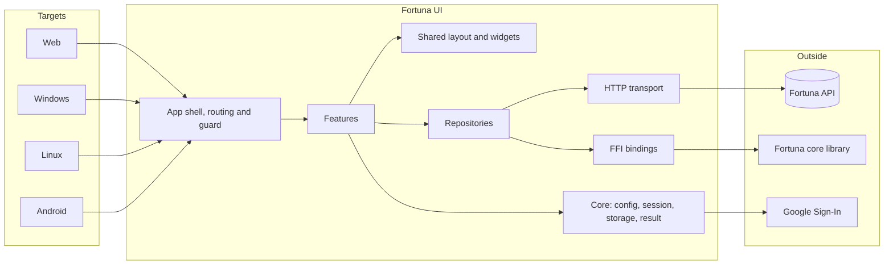
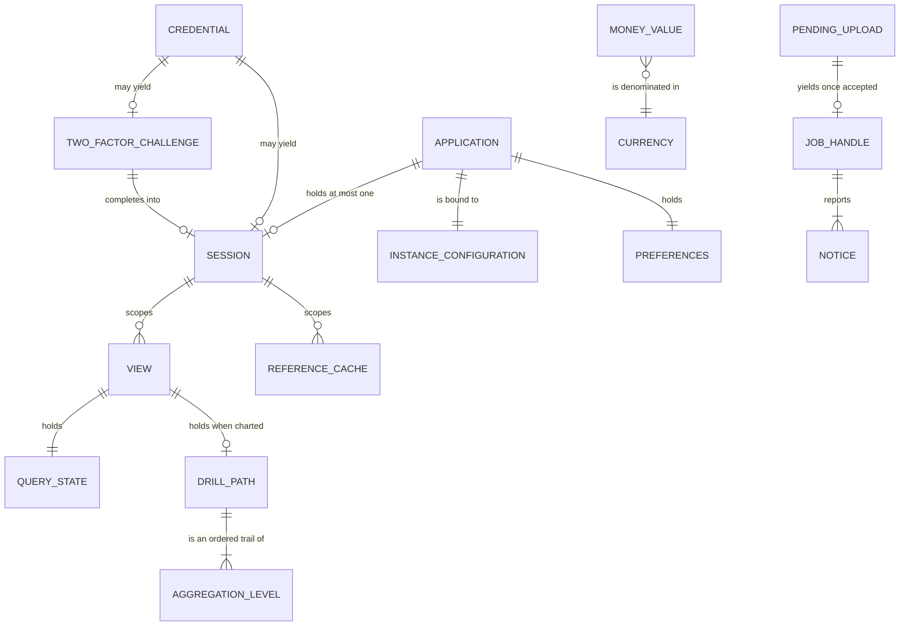
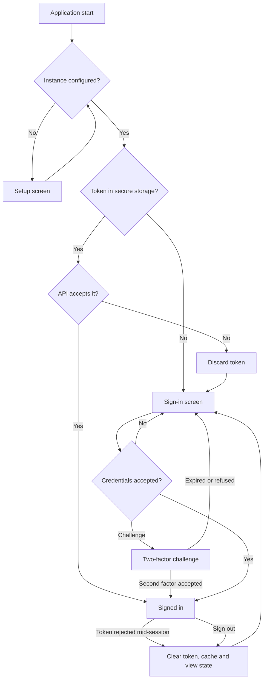

# System Requirements Document — Fortuna UI

## 1. Introduction

### 1.1 Purpose

This document specifies the functional and non-functional requirements for **Fortuna UI**.

The concrete technology stack — framework and language versions, libraries, storage and tooling —
is defined in the [Technology Stack Document](Technology%20Stack%20Document.md). This document
states requirements and refers to that one for specific technologies and versions rather than
restating them.

The financial domain itself is specified by the
[Fortuna API](https://github.com/artur-rios/fortuna-api) and is not restated here either. Where a
requirement below concerns a financial rule, it states what the *client* must do about it — present
it, respect it, or refuse to work around it — never what the rule is.

### 1.2 Scope

Fortuna UI covers: session and identity; instance and mode configuration; the data access layer and
its two transports; holdings; money movement; organization and planning; ingestion; attachments; the
tabular view; charts and drill-down; position and projection; export; record lifecycle and audit;
privacy and data rights; administration; and presentation. Each is one subsection of §3, and each
owns one area code.

### 1.3 Definitions

Terms shared with the [Vision Document](Vision%20Document.md) are defined there and not repeated.
These are additional and specific to this document.

| Term | Definition |
| --- | --- |
| **Transport** | The mechanism by which a repository reaches the Fortuna core — HTTP or FFI. Selected once, at build time. |
| **Repository** | A feature-owned interface over the operations that feature needs, with one implementation per transport. The seam every test substitutes at. |
| **View state** | The state of a data-backed screen: `Loading`, `Loaded`, `Empty` or `Failed`. |
| **Guard** | The single central route redirect that admits or refuses a route by session and role. |
| **Notice** | A message shown to the user, derived from an API answer or a local validation. Never invented. |
| **Reference data** | Currencies, categories, accounts, cards, tags and counterparties — the only data cached, and only in memory. |
| **Envelope** | The `DataOutput` wrapper the API returns, carrying the payload, the messages and the outcome. |

---

## 2. System Overview

The shape that matters: **features depend on repositories, never on a transport.** `HTTPT` and
`FFIT` are interchangeable below that line, and nothing above it may tell them apart.

---

## 3. Functional Requirements

### 3.1 Session and Identity — `SE`

| ID | Requirement |
| --- | --- |
| FR-SE-01 | The system shall let a user sign in with an email address and a password. |
| FR-SE-02 | The system shall let a user sign in with Google, and shall treat a first Google sign-in as account creation. |
| FR-SE-03 | The system shall present a two-factor challenge when the sign-in response carries one, and shall accept an authenticator code, an emailed code or a recovery code. |
| FR-SE-04 | The system shall grant no access while a two-factor challenge is outstanding, holding the same state as signed out. |
| FR-SE-05 | The system shall let a user of a desktop offline installation create a local account, and shall present its recovery codes once, stating that they cannot be retrieved again. |
| FR-SE-06 | The system shall let a user sign in to a desktop local account. |
| FR-SE-07 | The system shall let a user recover a desktop local account with a recovery code, and shall state that the code is spent. |
| FR-SE-08 | The system shall let a user regenerate their local account's recovery codes. |
| FR-SE-09 | The system shall offer no password reset path for a desktop local account, and shall explain why rather than failing silently. |
| FR-SE-10 | The system shall let a user request a password recovery message and complete a password reset. |
| FR-SE-11 | The system shall let a user verify their email address and request a new verification message. |
| FR-SE-12 | The system shall let a user enable two-factor authentication, choosing an authenticator app, email, or both. |
| FR-SE-13 | The system shall render the authenticator setup as a scannable code and offer the same secret as text. |
| FR-SE-14 | The system shall let a user confirm a pending two-factor setup, and shall present the resulting recovery codes once. |
| FR-SE-15 | The system shall let a user disable two-factor authentication and regenerate its recovery codes. |
| FR-SE-16 | The system shall store the session token only in the platform's secure storage. |
| FR-SE-17 | The system shall retain no credential beyond the request that carries it, and shall clear credential fields when the screen is left. |
| FR-SE-18 | The system shall restore a session at start, verify it against the API before showing any screen that depends on it, and discard it if the API rejects it. |
| FR-SE-19 | The system shall end the session and ask for credentials again when a token is rejected mid-session, without attempting a silent refresh. |
| FR-SE-20 | The system shall not automatically replay an action interrupted by an authentication failure. |
| FR-SE-21 | The system shall clear the token, all cached reference data and all view state on sign-out. |
| FR-SE-22 | The system shall obtain a Google ID token locally and submit it to the API, and shall reach no other external identity service. |
| FR-SE-23 | The system shall answer every sign-in rejection with the message the API returned, without distinguishing causes the API chose to make indistinguishable. |

### 3.2 Configuration and Modes — `CF`

| ID | Requirement |
| --- | --- |
| FR-CF-01 | The system shall read its API address and its identity client configuration from values supplied at build time. |
| FR-CF-02 | The system shall let a user of a self-hosted installation set the instance address, and shall validate that it is a well-formed URL before attempting a request. |
| FR-CF-03 | The system shall operate in one of three modes — connected, self-hosted or desktop offline — and shall present the same interface in all three. |
| FR-CF-04 | The system shall offer desktop offline mode only on Windows and Linux, and only where the installation provides the core library. |
| FR-CF-05 | The system shall offer no offline mode on the web or on Android. |
| FR-CF-06 | The system shall report a lost connection as a lost connection outside desktop offline mode, and shall not serve cached data as though it were current. |
| FR-CF-07 | The system shall present the sign-in paths its mode supports, offering local-account sign-in only in desktop offline mode and the identity-provider paths only outside it. |
| FR-CF-08 | The system shall confine platform-specific behavior to file selection, file saving, window chrome, secure-storage backing and offline availability. |

### 3.3 Data Access and Transport — `DA`

| ID | Requirement |
| --- | --- |
| FR-DA-01 | The system shall reach the Fortuna core through repository interfaces, and no feature, provider, screen or widget shall depend on a transport directly. |
| FR-DA-02 | The system shall provide one repository implementation per transport, and shall select between them by build configuration. |
| FR-DA-03 | The system shall behave identically for the same input regardless of transport. |
| FR-DA-04 | The system shall generate its HTTP client from the API's published OpenAPI document, and shall never hand-edit the result. |
| FR-DA-05 | The system shall generate its FFI bindings from the core's published C header, and shall never hand-edit the result. |
| FR-DA-06 | The system shall vendor the core's C header verbatim and shall fail its build when the vendored copy differs from the published one. |
| FR-DA-07 | The system shall confine `dart:ffi` to the bindings layer, and shall enforce that by static analysis. |
| FR-DA-08 | The system shall perform every call across the FFI boundary off the UI isolate. |
| FR-DA-09 | The system shall release every string returned by the core, including on failure paths. |
| FR-DA-10 | The system shall return a result value from every repository operation rather than throwing, so that a failure is a value the interface renders. |
| FR-DA-11 | The system shall carry a monetary amount across either transport as an exact decimal, and shall never parse one through a floating-point type. |
| FR-DA-12 | The system shall attach the session token to every request that requires one, and shall never place it in a URL. |
| FR-DA-13 | The system shall not report a write as successful until the API's response confirms it. |
| FR-DA-14 | The system shall present the API's own reason for a refusal, without substituting, softening or generalizing it. |
| FR-DA-15 | The system shall treat client-side validation as feedback only, submitting and honoring the API's answer even where the client expected success. |

### 3.4 Presentation and Preferences — `PS`

| ID | Requirement |
| --- | --- |
| FR-PS-01 | The system shall support the locales `en-US`, `en-GB`, `en-150` and `pt-BR`, and shall let the user choose among them. |
| FR-PS-02 | The system shall format every number, date and monetary amount according to the chosen locale. |
| FR-PS-03 | The system shall not alter a value when the locale changes — only its rendering. |
| FR-PS-04 | The system shall display every monetary amount with its currency. |
| FR-PS-05 | The system shall not visually sum or compare amounts in different currencies unless the API has converted them. |
| FR-PS-06 | The system shall round only at display, to the currency's own minor-unit precision, and shall never carry a rounded value onward. |
| FR-PS-07 | The system shall let the user choose a display currency, and shall obtain converted figures from the API rather than converting them. |
| FR-PS-08 | The system shall offer light, dark and system theme modes, and shall persist the choice. |
| FR-PS-09 | The system shall persist locale, theme and display currency in non-secure preference storage, and shall never place a token or a credential there. |
| FR-PS-10 | The system shall render every data-backed screen in one of four states — loading, loaded, empty or failed — and shall offer a retry from the failed state. |
| FR-PS-11 | The system shall not present stale content as current while reloading. |
| FR-PS-12 | The system shall distinguish a projected or scheduled figure from a recorded one in every view that shows both. |
| FR-PS-13 | The system shall show a soft-deleted record only where deleted records were asked for, and shall mark it as deleted. |

### 3.5 Holdings — `HO`

| ID | Requirement |
| --- | --- |
| FR-HO-01 | The system shall let a user create, view, update and delete a financial account. |
| FR-HO-02 | The system shall display an account's balance as the API reports it, and shall not compute one. |
| FR-HO-03 | The system shall present an account's currency as fixed after creation. |
| FR-HO-04 | The system shall let a user create, view, update and delete a credit card, including its limit, closing day and due day. |
| FR-HO-05 | The system shall display a card's limit and its consumption as the API reports them. |
| FR-HO-06 | The system shall let a user view a card's billing cycles and the statement of each. |
| FR-HO-07 | The system shall let a user close a statement, and shall present closing as irreversible. |
| FR-HO-08 | The system shall let a user settle a statement from a financial account, and shall present the settlement as a transfer rather than an expense. |
| FR-HO-09 | The system shall mark a charge the API reports as late-arriving in the statement that received it. |
| FR-HO-10 | The system shall let a user create, view, update and delete an investment. |
| FR-HO-11 | The system shall let a user record an investment movement and an investment valuation. |
| FR-HO-12 | The system shall display an investment's position as the API reports it, and shall never price an instrument. |
| FR-HO-13 | The system shall offer only the user's own accounts, cards and investments in any selection. |

### 3.6 Money Movement — `MM`

| ID | Requirement |
| --- | --- |
| FR-MM-01 | The system shall let a user record a transaction with a date, an amount, a direction, an owning account and a category. |
| FR-MM-02 | The system shall accept an amount as an exact decimal and shall never parse one through a floating-point type. |
| FR-MM-03 | The system shall reject an amount that is not greater than zero, in the form, stating why. |
| FR-MM-04 | The system shall reject a date more than one day in the future, in the form, and shall explain that a future movement is a recurring rule or a projection. |
| FR-MM-05 | The system shall let a user attach an optional description, tags and a counterparty to a transaction. |
| FR-MM-06 | The system shall let a user update and delete a transaction. |
| FR-MM-07 | The system shall let a user record a transfer between two of their own accounts, and shall refuse an origin and destination that are the same. |
| FR-MM-08 | The system shall present a transfer as neither an earning nor an expense. |
| FR-MM-09 | The system shall let a user record an installment purchase with a count of at least two, and shall display the resulting installments as the API generated them. |
| FR-MM-10 | The system shall let a user define, update and delete a recurring commitment with a frequency, a start date and an optional end date not before it. |
| FR-MM-11 | The system shall present a recurring commitment as a rule, distinct from the occurrences it has produced. |
| FR-MM-12 | The system shall let a user reconcile a transaction. |
| FR-MM-13 | The system shall show a transaction's source and, where it was imported, the record it derives from. |

### 3.7 Organization and Planning — `OR`

| ID | Requirement |
| --- | --- |
| FR-OR-01 | The system shall let a user create, view, update and delete a category, and shall present the categories as a tree. |
| FR-OR-02 | The system shall not offer a parent category that would create a cycle. |
| FR-OR-03 | The system shall let a user reassign transactions from one category to another. |
| FR-OR-04 | The system shall let a user create, view, update and delete tags. |
| FR-OR-05 | The system shall let a user create, view, update and delete counterparties. |
| FR-OR-06 | The system shall let a user define, view, update and delete a budget for a category over a period. |
| FR-OR-07 | The system shall display budget consumption as the API computes it. |
| FR-OR-08 | The system shall let a user define, view, update and delete a goal with a target amount and a future target date. |
| FR-OR-09 | The system shall display goal progress as the API computes it. |

### 3.8 Ingestion — `IN`

| ID | Requirement |
| --- | --- |
| FR-IN-01 | The system shall list the data sources the instance supports, and shall indicate which are unavailable in the current mode. |
| FR-IN-02 | The system shall obtain the user's consent before initiating any connection that discloses data to an external processor. |
| FR-IN-03 | The system shall let a user connect an institution, reaching the aggregator only through the API. |
| FR-IN-04 | The system shall let a user trigger a synchronization of a connection. |
| FR-IN-05 | The system shall let a user reauthenticate a connection the API reports as requiring it. |
| FR-IN-06 | The system shall let a user revoke a connection, stating that imported data is kept. |
| FR-IN-07 | The system shall let a user select a spreadsheet or statement file and upload it unmodified. |
| FR-IN-08 | The system shall not parse, transform, filter or repair an import file. |
| FR-IN-09 | The system shall validate a selected file's type against what the chosen source accepts before uploading it. |
| FR-IN-10 | The system shall present an import or synchronization as a job with progress, and shall not block the interface while it runs. |
| FR-IN-11 | The system shall keep a running job findable after the user navigates away, and shall keep its outcome available afterwards. |
| FR-IN-12 | The system shall present a job's per-row outcomes as the API reported them — imported, skipped as duplicate, or rejected with a reason — without summarizing them away. |
| FR-IN-13 | The system shall let a user retry a failed import job. |
| FR-IN-14 | The system shall let a user review the raw imported records of a job. |

### 3.9 Attachments — `AT`

| ID | Requirement |
| --- | --- |
| FR-AT-01 | The system shall let a user attach a document to a transaction. |
| FR-AT-02 | The system shall check a selected attachment's type and size against the instance's limits before uploading. |
| FR-AT-03 | The system shall let a user download an attachment and save it through the platform's file saving. |
| FR-AT-04 | The system shall let a user remove an attachment. |
| FR-AT-05 | The system shall show a transaction's attachments alongside it. |

### 3.10 Tabular View — `TB`

| ID | Requirement |
| --- | --- |
| FR-TB-01 | The system shall present records as a paginated grid. |
| FR-TB-02 | The system shall perform filtering, sorting and pagination by asking the API, and shall not filter or sort a full set locally. |
| FR-TB-03 | The system shall let a user filter by date range, account, category, tag, counterparty, direction and amount range. |
| FR-TB-04 | The system shall reject a date range whose start is after its end, in the form. |
| FR-TB-05 | The system shall preserve a view's filters, sort and page position across navigation away and back. |
| FR-TB-06 | The system shall let a user open a record from the grid into its detail. |
| FR-TB-07 | The system shall present a grid with no matching records as an empty state, distinct from a failure. |
| FR-TB-08 | The system shall scroll a grid wider than the viewport within its own bounds, without the page scrolling horizontally. |

### 3.11 Charts and Drill-Down — `CH`

| ID | Requirement |
| --- | --- |
| FR-CH-01 | The system shall present aggregations as charts, in the groupings the API supports — by period, category, account and counterparty. |
| FR-CH-02 | The system shall obtain every aggregation from the API and shall compute none. |
| FR-CH-03 | The system shall let a user select a chart element and descend into the breakdown behind it. |
| FR-CH-04 | The system shall request each drill-down level from the API, and shall not subdivide an aggregate it already holds. |
| FR-CH-05 | The system shall resolve a drill-down at its finest level to the individual transactions behind it. |
| FR-CH-06 | The system shall let a user reverse a drill-down to the level it came from, at every level. |
| FR-CH-07 | The system shall show the current drill path, so that a user always knows what the figures on screen are bounded by. |
| FR-CH-08 | The system shall treat a chart coordinate as presentation only, and shall read a value from the data behind an element rather than from its position. |
| FR-CH-09 | The system shall render charts legibly under both the light and the dark theme. |
| FR-CH-10 | The system shall present a chart with no data as an empty state, distinct from a failure. |

### 3.12 Position and Projection — `PJ`

| ID | Requirement |
| --- | --- |
| FR-PJ-01 | The system shall present the user's net position as the API reports it. |
| FR-PJ-02 | The system shall present forward cash-flow projections over a period the user chooses. |
| FR-PJ-03 | The system shall present committed obligations — installments and recurring commitments not yet materialized. |
| FR-PJ-04 | The system shall mark every projected figure as projected, in every view that mixes it with recorded figures. |
| FR-PJ-05 | The system shall never present a projection as a recorded fact, and shall never persist one. |

### 3.13 Export — `EX`

| ID | Requirement |
| --- | --- |
| FR-EX-01 | The system shall let a user export a data set as CSV, Excel or PDF. |
| FR-EX-02 | The system shall ask the API to produce every export, and shall render none itself. |
| FR-EX-03 | The system shall apply the current view's filters to an export, and shall state what the export covers before producing it. |
| FR-EX-04 | The system shall present an export as a job with progress, without blocking the interface. |
| FR-EX-05 | The system shall save a completed export through the platform's own file saving. |

### 3.14 Lifecycle and Audit — `LC`

| ID | Requirement |
| --- | --- |
| FR-LC-01 | The system shall present deletion and permanent removal as two distinct actions, each separately confirmed. |
| FR-LC-02 | The system shall offer permanent removal only for a record already deleted. |
| FR-LC-03 | The system shall state that a permanent removal cannot be undone. |
| FR-LC-04 | The system shall let a user restore a deleted record. |
| FR-LC-05 | The system shall present the API's refusal to permanently remove a record that is still referenced, with its reason. |
| FR-LC-06 | The system shall let a user read the audit trail of their own records, filtered by period and kind of action. |

### 3.15 Privacy and Data Rights — `PR`

| ID | Requirement |
| --- | --- |
| FR-PR-01 | The system shall present the disclosure and record the user's decision before any data reaches an external processor. |
| FR-PR-02 | The system shall not infer consent from the use of a feature. |
| FR-PR-03 | The system shall let a user review the consents they hold, and the version of what they agreed to. |
| FR-PR-04 | The system shall let a user withdraw a consent wherever it can be granted, and shall state what withdrawing revokes. |
| FR-PR-05 | The system shall re-ask for consent when the API reports the agreed version as outdated. |
| FR-PR-06 | The system shall let a user request a complete export of everything the system holds about them, and retrieve it when ready. |
| FR-PR-07 | The system shall let a user erase their account, confirmed explicitly and separately from any record deletion. |
| FR-PR-08 | The system shall state, before an erasure is confirmed, that it is irreversible and that the audit trail survives without identifying them. |
| FR-PR-09 | The system shall identify the data controller for the current deployment shape, naming the user themselves in self-hosted and offline installations. |
| FR-PR-10 | The system shall surface the privacy notice and the route for rights requests when running against a shared instance. |
| FR-PR-11 | The system shall send no analytics, telemetry or crash report anywhere, and shall include no third-party component that observes use. |
| FR-PR-12 | The system shall write no financial data, credential or token to any log, and shall emit no log at all from a release build. |

### 3.16 Administration — `AD`

| ID | Requirement |
| --- | --- |
| FR-AD-01 | The system shall present an administrative area to an instance administrator and to no other role. |
| FR-AD-02 | The system shall present the instance's health and the status of its dependencies as the API reports them. |
| FR-AD-03 | The system shall present no financial figure, record or aggregate anywhere in the administrative area. |
| FR-AD-04 | The system shall present no financial data to an administrator in any error message or diagnostic. |
| FR-AD-05 | The system shall show an account owner no administrative surface, and no indication that one exists. |
| FR-AD-06 | The system shall guard every route centrally by session and role, and shall apply the same guard to a route reached by a typed URL, a deep link or a restored session. |
| FR-AD-07 | The system shall not rely on a hidden control as a protection, and nothing concealed shall be reachable by manipulating client state. |

---

## 4. Data Model

### 4.0 Identifier Strategy

This application defines no identifiers of its own. Every record it displays is addressed by the
identifier the API assigned it, carried opaquely: the client neither parses, derives, orders nor
constructs one, and treats them as strings whose only meaningful operation is equality.

The two identifiers the client does own are local and non-durable: a **view key**, distinguishing
one open view's state from another's within a session, and a **job handle**, which wraps the API's
own job identifier for tracking purposes. Neither is ever sent to the API as though it were a
domain identifier, and neither survives a restart.

### 4.1 Entity Relationship Diagram

### 4.2 Session Fields

| Field | Type | Constraints | Description |
| --- | --- | --- | --- |
| SubjectReference | string | Required | The opaque subject the API's token names. Never displayed as an identity. |
| Role | enum | Required — account owner or instance administrator | What the guard admits. |
| Mode | enum | Required — connected, self-hosted or desktop offline | Which shape this installation runs in. |
| Token | string | Required; secure storage only | Never in preferences, never in a URL, never in state that outlives the session. |
| ExpiresAt | timestamp | Optional | When known, used to end the session proactively rather than on the next refusal. |

### 4.3 TwoFactorChallenge Fields

| Field | Type | Constraints | Description |
| --- | --- | --- | --- |
| ChallengeToken | string | Required; held in memory only | Proves the first factor succeeded. Never written to storage. |
| Methods | list of enum | Required, at least one | Which second factors this account accepts. |
| ExpiresAt | timestamp | Required | After which the challenge is abandoned and sign-in restarts. |

### 4.4 InstanceConfiguration Fields

| Field | Type | Constraints | Description |
| --- | --- | --- | --- |
| Address | string | Required in connected and self-hosted modes; a well-formed URL | Where the API is. Absent in desktop offline mode. |
| Mode | enum | Required | Which of the three shapes. |
| OfflineAvailable | bool | Required | Whether this installation carries the core library. False on web and Android always. |

### 4.5 Preferences Fields

| Field | Type | Constraints | Description |
| --- | --- | --- | --- |
| ThemeMode | enum | Required — light, dark or system | Defaults to system. |
| Locale | enum | Required — `en-US`, `en-GB`, `en-150` or `pt-BR` | Defaults to the platform's, falling back to `en-US`. |
| DisplayCurrency | string | Optional; an ISO 4217 code the API supports | Absent means each figure shows in its own currency. |

### 4.6 MoneyValue Fields

| Field | Type | Constraints | Description |
| --- | --- | --- | --- |
| Amount | decimal | Required; **never a floating-point type** | Parsed from the API's string form and held exactly. |
| CurrencyCode | string | Required; ISO 4217 | An amount is never carried without it. |
| IsProjected | bool | Required | Whether this figure is a forecast rather than a record. Drives the distinction `FR-PS-12` requires. |

### 4.7 QueryState Fields

| Field | Type | Constraints | Description |
| --- | --- | --- | --- |
| Filters | map | Optional | The filter set, submitted to the API rather than applied locally. |
| Sort | string | Optional | The field and direction, submitted to the API. |
| Page | int | Required; at least 1 | The current page. |
| PageSize | int | Required; bounded by what the API accepts | How many records per page. |

### 4.8 DrillPath Fields

| Field | Type | Constraints | Description |
| --- | --- | --- | --- |
| Levels | ordered list | Required; at least one | The trail descended, coarsest first. Its length is the current depth. |
| Bounds | map | Required | What the current level is filtered by — what the figures on screen are bounded by. |

### 4.9 JobHandle Fields

| Field | Type | Constraints | Description |
| --- | --- | --- | --- |
| JobId | string | Required | The API's own job identifier, carried opaquely. |
| Kind | enum | Required — import, synchronization or export | What is running. |
| Status | enum | Required | As the API reports it. |
| Progress | int | Optional | Where the API supplies one. |
| Outcome | object | Optional | The per-row results or the produced file, once finished. |

---

## 5. Screen Surface Overview

This application's interface surface is its screens, not endpoints. Each is reached by a route, and
every route passes the single central guard (`FR-AD-06`).

### 5.1 Session and configuration

| Route | Screen | Access | Requirement |
| --- | --- | --- | --- |
| `/setup` | Instance and mode configuration | Anonymous | FR-CF-02 |
| `/sign-in` | Credential and Google sign-in | Anonymous | FR-SE-01, FR-SE-02 |
| `/sign-in/two-factor` | Two-factor challenge | Challenge held | FR-SE-03 |
| `/sign-in/local` | Local account sign-in | Anonymous, offline mode | FR-SE-06 |
| `/sign-in/local/create` | Local account creation | Anonymous, offline mode | FR-SE-05 |
| `/sign-in/local/recover` | Local account recovery | Anonymous, offline mode | FR-SE-07 |
| `/password-recovery` | Password recovery and reset | Anonymous | FR-SE-10 |
| `/verify-email` | Email verification | Anonymous | FR-SE-11 |

### 5.2 The owner's application

| Route | Screen | Access | Requirement |
| --- | --- | --- | --- |
| `/` | Overview: net position, recent movement, budget and goal summary | Owner | FR-PJ-01 |
| `/accounts`, `/accounts/:id` | Financial accounts | Owner | FR-HO-01 |
| `/cards`, `/cards/:id` | Credit cards | Owner | FR-HO-04 |
| `/cards/:id/statements/:statementId` | A statement, its charges and its settlement | Owner | FR-HO-06 |
| `/investments`, `/investments/:id` | Investments, movements and valuations | Owner | FR-HO-10 |
| `/transactions` | The spreadsheet view | Owner | FR-TB-01 |
| `/transactions/new`, `/transactions/:id` | Recording and editing money movement | Owner | FR-MM-01 |
| `/transfers/new` | Recording a transfer | Owner | FR-MM-07 |
| `/installments/new` | Recording an installment purchase | Owner | FR-MM-09 |
| `/recurring` | Recurring commitments | Owner | FR-MM-10 |
| `/categories` | The category tree | Owner | FR-OR-01 |
| `/tags`, `/counterparties` | Tags and counterparties | Owner | FR-OR-04, FR-OR-05 |
| `/budgets`, `/goals` | Budgets and goals | Owner | FR-OR-06, FR-OR-08 |
| `/insight` | Charts and drill-down | Owner | FR-CH-01 |
| `/insight/projections` | Projections and committed obligations | Owner | FR-PJ-02 |
| `/sources` | Data sources, connections and consent | Owner | FR-IN-01 |
| `/imports`, `/imports/:jobId` | Import files, jobs and imported records | Owner | FR-IN-07, FR-IN-10 |
| `/deleted` | Deleted records: restore or remove permanently | Owner | FR-LC-01 |
| `/audit` | The audit trail | Owner | FR-LC-06 |
| `/settings` | Theme, locale, display currency | Owner, administrator | FR-PS-01 |
| `/settings/security` | Two-factor setup and recovery codes | Owner | FR-SE-12 |
| `/settings/privacy` | Consents, complete export, erasure, controller and notice | Owner | FR-PR-03 |

### 5.3 The administrator's application

| Route | Screen | Access | Requirement |
| --- | --- | --- | --- |
| `/admin` | Instance overview and health | Administrator | FR-AD-02 |

---

## 6. Non-Functional Requirements

| ID | Category | Requirement |
| --- | --- | --- |
| NFR-01 | Performance | The system shall hold 60 frames per second during scrolling and chart animation, with no frame exceeding 16 ms. |
| NFR-02 | Performance | The system shall paint a screen backed by a single API read within 100 ms of that response arriving. |
| NFR-03 | Performance | The system shall reach an interactive first screen within 3 seconds of a cold start on desktop, and within 5 seconds on the web over a normal connection. |
| NFR-04 | Performance | The system shall never block the interface on work the API defines as asynchronous. |
| NFR-05 | Performance | The system shall never block the UI isolate on a call across the FFI boundary. |
| NFR-06 | Correctness | The system shall represent no monetary value as a binary floating-point type, at any layer, and shall enforce this by static analysis and by test. |
| NFR-07 | Security | The system shall store the session token only in the platform's secure storage. |
| NFR-08 | Security | The system shall retain no credential beyond the request carrying it. |
| NFR-09 | Security | The system shall transmit no data to any destination other than the Fortuna API and the Google sign-in endpoint. |
| NFR-10 | Security | The system shall enforce access by a single central route guard rather than per screen. |
| NFR-11 | Privacy | The system shall include no analytics, telemetry or crash reporting. |
| NFR-12 | Privacy | The system shall satisfy the GDPR and the LGPD in the obligations that fall to a client: consent before disclosure, a complete export, and an erasure path. |
| NFR-13 | Reliability | The system shall release every string returned across the FFI boundary, including on failure paths. |
| NFR-14 | Reliability | The system shall present a failure as a failure, offering a retry, and shall never present stale data as current. |
| NFR-15 | Portability | The system shall build and run on web, Windows, Linux and Android from one source, with platform-specific code confined to what `FR-CF-08` names. |
| NFR-16 | Portability | The system shall render legibly under both light and dark themes, and at mobile, tablet and desktop widths. |
| NFR-17 | Accessibility | The system shall label every interactive element for assistive technology, and shall not convey meaning by color alone — including the distinction between projected and recorded figures. |
| NFR-18 | Maintainability | The system shall keep generated code generated: the API client and the FFI bindings are never hand-edited, and CI fails on drift. |
| NFR-19 | Maintainability | The system shall keep the transport invisible above the data layer, so that a feature is written once and works under both. |
| NFR-20 | Localization | The system shall present every user-facing string, number, date and amount in the chosen locale, with no hard-coded formatting. |

---

## 7. Authorization Matrix

| Operation | Anonymous | Account owner | Instance administrator |
| --- | --- | --- | --- |
| Configure the instance and mode | ✅ | ✅ | ✅ |
| Sign in, complete a challenge, recover a password | ✅ | ⚠️ already signed in | ⚠️ already signed in |
| Create or recover a desktop local account | ⚠️ offline mode only | ❌ | ❌ |
| Manage own two-factor authentication | ❌ | ✅ | ✅ |
| View and manage own holdings | ❌ | ✅ | ❌ |
| Record and manage own money movement | ❌ | ✅ | ❌ |
| Manage own categories, tags, counterparties, budgets and goals | ❌ | ✅ | ❌ |
| Manage own connections and imports | ❌ | ✅ | ❌ |
| Read own tables, charts, drill-downs, position and projections | ❌ | ✅ | ❌ |
| Export own data | ❌ | ✅ | ❌ |
| Restore or permanently remove own deleted records | ❌ | ✅ | ❌ |
| Read own audit trail | ❌ | ✅ | ❌ |
| Give, review or withdraw own consents | ❌ | ✅ | ❌ |
| Export all own personal data, or erase own account | ❌ | ✅ | ❌ |
| Choose theme, locale and display currency | ❌ | ✅ | ✅ |
| Reach the administrative area | ❌ | ❌ | ✅ |
| View instance health | ❌ | ❌ | ✅ |
| See any user's financial figures | ❌ | ⚠️ their own only | ❌ |

**Legend:** ✅ allowed · ⚠️ allowed under the stated condition · ❌ denied.

The last row is the one to read twice. An instance administrator is denied financial data
everywhere, without exception — the interface offers no path to it, and the API refuses it besides.

---

## 8. Lifecycle Strategy

Three lifecycles matter to this application: the session, a data-backed view, and a record's
deletion. The first two are the client's own; the third mirrors the API's and is presented, never
reimplemented.

**Deletion, as the interface presents it.** The API's two stages are two separate, separately
confirmed actions, and the interface never collapses them. Deleting a record removes it from every
view except the deleted-records view, where it is marked as deleted and can be restored. Permanent
removal is offered only from there, is stated to be irreversible, and is refused by the API while
any live record still references the target — a refusal presented with its reason rather than
pre-empted by a hidden control.

**Erasure is not that lifecycle.** Erasing an account is a single irreversible act with its own
confirmation, and the interface says plainly that it is not a deletion that can be restored, and
that the audit trail survives without identifying the user.

---

## 9. Traceability

### 9.1 Area codes

| Domain area | Code | Requirements |
| --- | --- | --- |
| Session and identity | `SE` | FR-SE-01 … FR-SE-23 |
| Configuration and modes | `CF` | FR-CF-01 … FR-CF-08 |
| Data access and transport | `DA` | FR-DA-01 … FR-DA-15 |
| Presentation and preferences | `PS` | FR-PS-01 … FR-PS-13 |
| Holdings | `HO` | FR-HO-01 … FR-HO-13 |
| Money movement | `MM` | FR-MM-01 … FR-MM-13 |
| Organization and planning | `OR` | FR-OR-01 … FR-OR-09 |
| Ingestion | `IN` | FR-IN-01 … FR-IN-14 |
| Attachments | `AT` | FR-AT-01 … FR-AT-05 |
| Tabular view | `TB` | FR-TB-01 … FR-TB-08 |
| Charts and drill-down | `CH` | FR-CH-01 … FR-CH-10 |
| Position and projection | `PJ` | FR-PJ-01 … FR-PJ-05 |
| Export | `EX` | FR-EX-01 … FR-EX-05 |
| Lifecycle and audit | `LC` | FR-LC-01 … FR-LC-06 |
| Privacy and data rights | `PR` | FR-PR-01 … FR-PR-12 |
| Administration | `AD` | FR-AD-01 … FR-AD-07 |

### 9.2 Feature to requirements

| Feature | Requirements |
| --- | --- |
| F-01 Sign in and session | FR-SE-01 through FR-SE-09, FR-SE-16 through FR-SE-23 |
| F-02 Credential and two-factor management | FR-SE-10 through FR-SE-15 |
| F-03 Instance and mode configuration | FR-CF-01 through FR-CF-08 |
| F-04 Holdings | FR-HO-01 through FR-HO-05, FR-HO-10 through FR-HO-13 |
| F-05 Credit card cycles | FR-HO-06 through FR-HO-09 |
| F-06 Money movement | FR-MM-01 through FR-MM-13 |
| F-07 Organization | FR-OR-01 through FR-OR-05 |
| F-08 Planning | FR-OR-06 through FR-OR-09 |
| F-09 Ingestion | FR-IN-01 through FR-IN-14 |
| F-10 Attachments | FR-AT-01 through FR-AT-05 |
| F-11 Spreadsheet view | FR-TB-01 through FR-TB-08 |
| F-12 Charts and drill-down | FR-CH-01 through FR-CH-10 |
| F-13 Position and projection | FR-PJ-01 through FR-PJ-05 |
| F-14 Export | FR-EX-01 through FR-EX-05 |
| F-15 Lifecycle and audit | FR-LC-01 through FR-LC-06 |
| F-16 Data rights | FR-PR-01 through FR-PR-12 |
| F-17 Administration | FR-AD-01 through FR-AD-07 |
| F-18 Presentation | FR-PS-01 through FR-PS-13 |

The `DA` area realizes no single feature: it is the layer every feature is built on, and it is
traced by business rule below and exercised by the use cases that cross it.

### 9.3 Business rule to requirements

| Business Rule | Realized by |
| --- | --- |
| BR-01 The API is the sole authority | FR-DA-01, FR-DA-13, FR-HO-02, FR-CH-02 |
| BR-02 No figure computed locally | FR-HO-02, FR-HO-05, FR-HO-12, FR-OR-07, FR-OR-09, FR-CH-02, FR-PJ-01 |
| BR-03 Validation is feedback, not permission | FR-DA-15, FR-MM-03, FR-MM-04 |
| BR-04 Nothing succeeds on optimism | FR-DA-13 |
| BR-05 The API's reason is shown | FR-DA-14, FR-LC-05, FR-SE-23 |
| BR-06 Money is an exact decimal | FR-DA-11, FR-MM-02, NFR-06 |
| BR-07 Currency always accompanies an amount | FR-PS-04, FR-PS-05 |
| BR-08 Rounding at display only | FR-PS-06 |
| BR-09 Locale formats, never alters | FR-PS-02, FR-PS-03, NFR-20 |
| BR-10 A chart coordinate is not a value | FR-CH-08 |
| BR-11 Projected is distinguishable | FR-PS-12, FR-PJ-04, NFR-17 |
| BR-12 Deleted records are marked | FR-PS-13 |
| BR-13 Aggregates are drillable and reversible | FR-CH-03, FR-CH-05, FR-CH-06, FR-CH-07 |
| BR-14 Drill-down is requested, not derived | FR-CH-04 |
| BR-15 Credentials are never retained | FR-SE-17, NFR-08 |
| BR-16 Tokens live in secure storage | FR-SE-16, FR-DA-12, NFR-07 |
| BR-17 Expiry ends the session | FR-SE-19, FR-SE-20 |
| BR-18 Sign-out clears everything | FR-SE-21 |
| BR-19 A challenge grants nothing | FR-SE-04 |
| BR-20 Authentication only through the API | FR-SE-22, NFR-09 |
| BR-21 The interface shows only what the role may do | FR-AD-01, FR-AD-03, FR-AD-05 |
| BR-22 Guarding is central | FR-AD-06, NFR-10 |
| BR-23 Hiding is not protection | FR-AD-07 |
| BR-24 One interface across modes | FR-CF-03 |
| BR-25 Offline only where it works | FR-CF-04, FR-CF-05, FR-CF-07 |
| BR-26 No pretending to be online | FR-CF-06, NFR-14 |
| BR-27 Platform branching is confined | FR-CF-08, NFR-15 |
| BR-28 Import files are untouched | FR-IN-07, FR-IN-08 |
| BR-29 Exports are the API's | FR-EX-02, FR-EX-05 |
| BR-30 Async work never blocks | FR-IN-10, FR-IN-11, FR-EX-04, NFR-04 |
| BR-31 Per-row outcomes are shown | FR-IN-12, FR-IN-14 |
| BR-32 No persistent financial data | FR-PR-12, NFR-11 |
| BR-33 Reference data is invalidated | FR-PS-11 |
| BR-34 Nothing is logged outward | FR-PR-11, FR-PR-12, NFR-09 |
| BR-35 The transport is invisible | FR-DA-01, FR-DA-02, FR-DA-03, NFR-19 |
| BR-36 Generated code is generated | FR-DA-04, FR-DA-05, FR-DA-06, NFR-18 |
| BR-37 The boundary is off-isolate and leak-free | FR-DA-07, FR-DA-08, FR-DA-09, NFR-05, NFR-13 |
| BR-38 The controller depends on the shape | FR-PR-09, FR-PR-10 |
| BR-39 Nothing observes the user | FR-PR-11, NFR-11 |
| BR-40 Consent precedes disclosure | FR-IN-02, FR-PR-01, FR-PR-02, FR-PR-04, FR-PR-05 |
| BR-41 Export and erasure are reachable | FR-PR-06, FR-PR-07, NFR-12 |
| BR-42 Erasure is presented as irreversible | FR-PR-08, FR-LC-03 |
