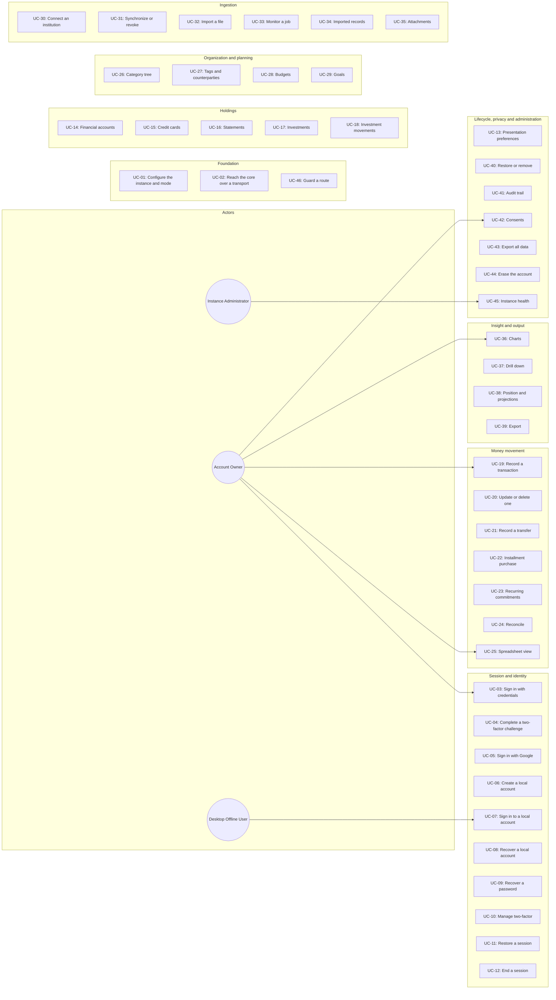
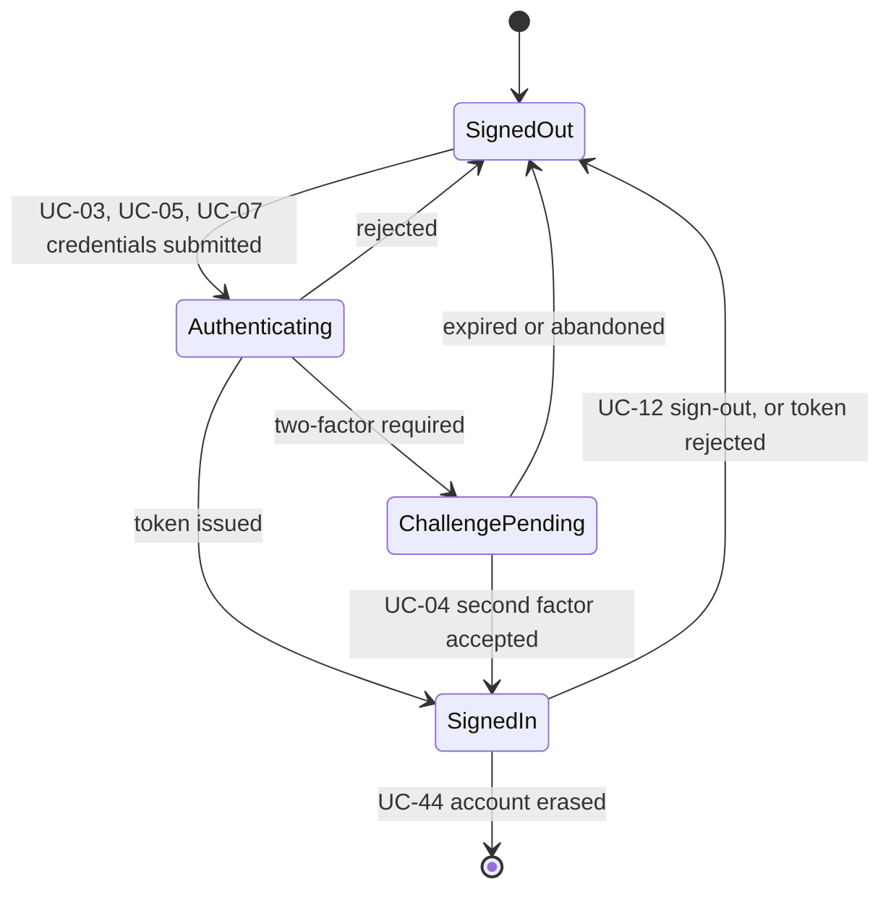
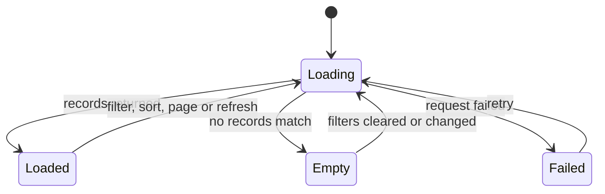
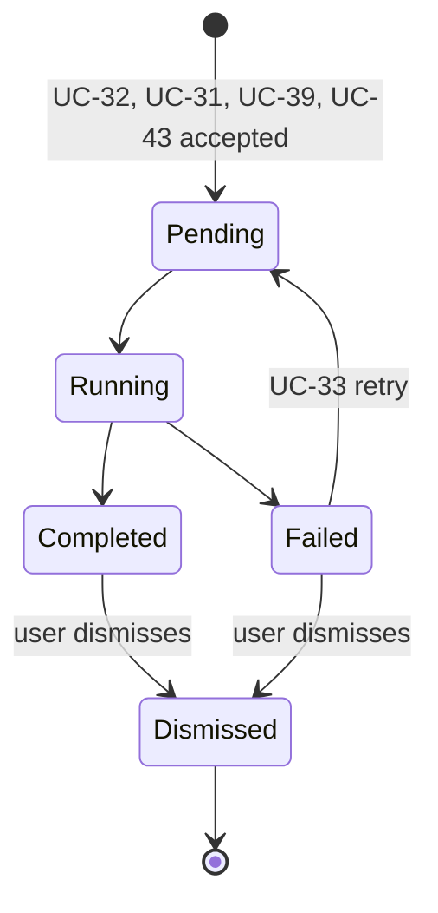
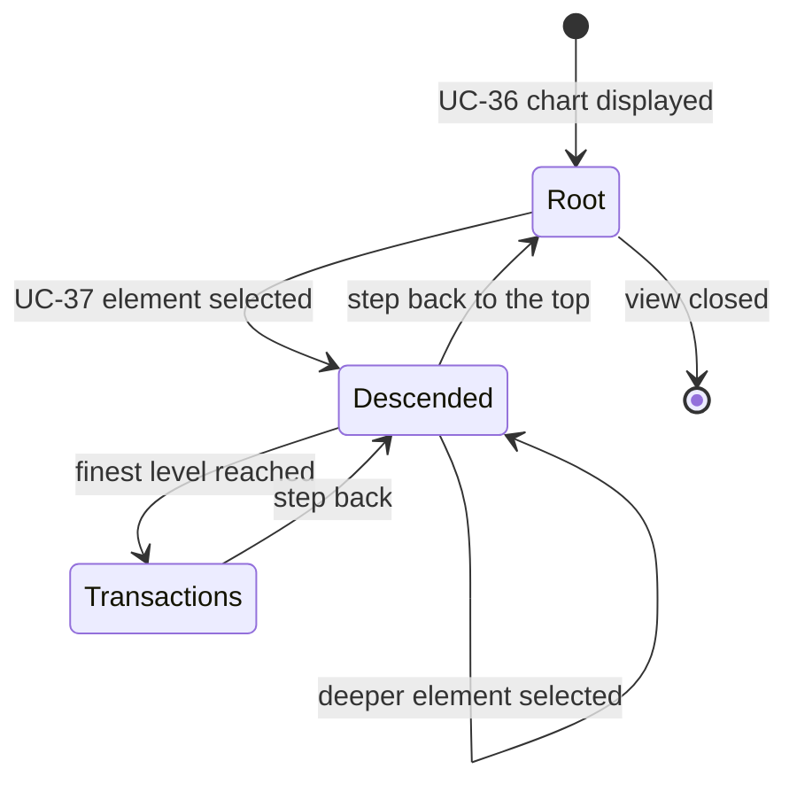

# Use Case Specification Document — Fortuna UI

## 1. Introduction

### 1.1 Purpose

This document specifies the use cases for **Fortuna UI**. Each one describes the actor interactions,
preconditions, postconditions, main flow, and alternative and exception flows for a single
user-visible capability.

Two conventions apply throughout, and they are what make these use cases shorter than they would
otherwise be:

- **Every `{id}` is the API's own identifier**, carried opaquely. The client never parses, derives
  or constructs one (System Requirements §4.0).
- **Every refusal is the API's refusal**, presented with the API's reason (`FR-DA-14`). Where an
  alternative flow below says "the system presents the refusal", it means exactly that — not a
  message this application composed.

A third convention is worth stating once rather than repeating in forty-six alternative flow tables:
**any use case can lose its session**. A token rejected mid-flow ends the session and returns the
user to sign-in without replaying the interrupted action (`FR-SE-19`, `FR-SE-20`). It is enumerated
only where it interacts with the flow in some particular way.

### 1.2 Actors

| Actor | Description |
| --- | --- |
| **Account Owner** | The everyday user. Owns a set of financial records and sees only their own. |
| **Instance Administrator** | Runs a shared instance. Reaches the administrative area and no financial data whatsoever. |
| **Desktop Offline User** | An account owner on a Windows or Linux installation running with no network. Signs in against a local account. Holds exactly the account owner's permissions. |
| **Fortuna API** | The system this application consumes. The authority on every fact displayed. |
| **Fortuna Core** | The same domain as a native library, reached across the FFI boundary in desktop offline mode. |
| **Google Sign-In** | Issues the ID token the API exchanges for a session. The only external service this application touches directly. |

### 1.3 Use Case Overview

---

## 2. Use Case Specifications

---

### UC-01: Configure the Instance and Mode

| Field | Value |
| --- | --- |
| **ID** | UC-01 |
| **Name** | Configure the Instance and Mode |
| **Actors** | Account Owner, Instance Administrator, Desktop Offline User |
| **Description** | Establish which Fortuna instance this installation talks to and in which of the three shapes it runs, so that every later use case has somewhere to send its requests |
| **Preconditions** | The application has started |
| **Postconditions** | The instance address and mode are resolved and persisted; the sign-in paths the mode supports are the ones offered |
| **Requirements** | FR-CF-01, FR-CF-02, FR-CF-03, FR-CF-04, FR-CF-05, FR-CF-06, FR-CF-07, FR-CF-08, FR-DA-01, FR-DA-02, FR-DA-03 |

**Main Flow**

1. The application starts and reads the API address and identity client configuration compiled in at build time.
2. The system determines whether this installation carries the core library, and therefore whether desktop offline mode is available.
3. Where a build-time address is present and no local configuration overrides it, the system adopts it and proceeds.
4. Otherwise the system presents the setup screen, and the user supplies the instance address or chooses desktop offline mode.
5. The system validates that a supplied address is a well-formed URL before attempting any request.
6. The system persists the resolved configuration and selects the matching transport.
7. The system presents the sign-in paths the resolved mode supports.

**Alternative Flows**

| ID | Condition | Outcome |
| --- | --- | --- |
| AF-01 | The supplied address is not a well-formed URL | Rejected in the form, before any request is attempted |
| AF-02 | The instance is unreachable at the supplied address | The system reports it as unreachable and keeps the user on the setup screen; the address is not persisted |
| AF-03 | Desktop offline mode is chosen on a target that cannot support it | The option is not offered at all on the web or Android, and not offered on a desktop installation without the core library |
| AF-04 | The core library is present but fails to load | The system reports that offline mode is unavailable in this installation, and offers the connected paths instead |
| AF-05 | The instance is reachable but reports an incompatible version | The system presents the incompatibility and refuses to proceed rather than failing later in an unrelated screen |
| AF-06 | The connection is lost after configuration, outside desktop offline mode | The system reports a lost connection as such, and does not serve cached data as though it were current |

---

### UC-02: Reach the Fortuna Core Over the Configured Transport

| Field | Value |
| --- | --- |
| **ID** | UC-02 |
| **Name** | Reach the Fortuna Core Over the Configured Transport |
| **Actors** | Fortuna API, Fortuna Core |
| **Description** | Carry every operation to the core over whichever transport this installation was built for, so that no feature above the data layer knows or cares which one it is. A mechanism rather than a screen — it is what every other use case is built on |
| **Preconditions** | UC-01 has resolved a mode and selected a transport |
| **Postconditions** | The operation's result is available as a value; nothing has been transmitted anywhere but the API |
| **Requirements** | FR-DA-04, FR-DA-05, FR-DA-06, FR-DA-07, FR-DA-08, FR-DA-09, FR-DA-10, FR-DA-11, FR-DA-13, FR-DA-15, FR-PR-11, FR-PR-12 |

**Main Flow**

1. A feature calls a repository interface, naming an operation and its input.
2. The repository's implementation for the configured transport carries the call: over HTTP through the client generated from the API's OpenAPI document, or across the FFI boundary through the bindings generated from the core's C header.
3. An FFI call is dispatched to a worker isolate, so the UI isolate is never blocked.
4. The transport carries monetary amounts as exact decimals, never parsing one through a floating-point type.
5. The transport returns a result value rather than throwing, so that a failure is a value the interface can render.
6. Any string the core returned is released, including where the call failed.
7. The feature receives the result, which reports a write as successful only where the response confirmed it.

**Alternative Flows**

| ID | Condition | Outcome |
| --- | --- | --- |
| AF-01 | The operation fails at the transport — unreachable host, timeout, or a core error | A failure result carrying the reason; no exception escapes the data layer |
| AF-02 | The API refuses the operation | A failure result carrying the API's own reason, which the interface presents unaltered |
| AF-03 | The client believed the input valid and the API refused it anyway | The API's answer stands; the client's expectation never overrides it |
| AF-04 | The vendored C header differs from the core's published one | The build fails; the drift is never discovered at run time |
| AF-05 | The generated client or bindings differ from what regeneration produces | CI fails; neither is hand-edited to reconcile it |
| AF-06 | Code outside the bindings layer imports `dart:ffi` | Static analysis fails the build |
| AF-07 | A response carries a field the generated client does not know | The unknown field is ignored rather than crashing the parse; the contract is fixed at the API and regenerated |

---

### UC-03: Sign In with Credentials

| Field | Value |
| --- | --- |
| **ID** | UC-03 |
| **Name** | Sign In with Credentials |
| **Actors** | Account Owner, Instance Administrator, Fortuna API |
| **Description** | Exchange an email address and password for a session |
| **Preconditions** | The instance is configured and reachable; the mode is connected or self-hosted |
| **Postconditions** | A session is held, or a two-factor challenge is; the credential is retained nowhere |
| **Requirements** | FR-SE-01, FR-SE-23, FR-DA-14 |

**Main Flow**

1. The user enters an email address and a password.
2. The system validates that the address is well-formed and the password non-empty.
3. The system submits the credentials to the API.
4. The API answers with a session token.
5. The system stores the token in secure storage and clears the credential fields.
6. The system routes the user to the screen their role admits.

**Alternative Flows**

| ID | Condition | Outcome |
| --- | --- | --- |
| AF-01 | The address is malformed or the password is empty | Rejected in the form; nothing is submitted |
| AF-02 | The API rejects the credentials, for any reason | The system presents the API's single message for every rejection, and does not distinguish an unknown account from a wrong password |
| AF-03 | The account has two-factor authentication active | The API answers with a challenge rather than a token, and the flow continues in UC-04 |
| AF-04 | The API is unreachable | The system reports a lost connection and offers a retry; the credential is not retained for it |
| AF-05 | The user leaves the screen with fields filled | The credential fields are cleared |
| AF-06 | The account's email address is unverified and the API requires verification | The system presents the API's reason and offers the verification path of UC-09 |

---

### UC-04: Complete a Two-Factor Challenge

| Field | Value |
| --- | --- |
| **ID** | UC-04 |
| **Name** | Complete a Two-Factor Challenge |
| **Actors** | Account Owner, Instance Administrator, Fortuna API |
| **Description** | Satisfy the second factor a sign-in demanded, and convert the challenge into a session |
| **Preconditions** | A two-factor challenge is held, and has not expired |
| **Postconditions** | A session is held and the challenge is discarded; or the challenge is abandoned and sign-in restarts |
| **Requirements** | FR-SE-03, FR-SE-04 |

**Main Flow**

1. The system presents the second-factor methods the challenge names.
2. The user supplies an authenticator code, an emailed code, or a recovery code.
3. The system submits the code with the challenge.
4. The API answers with a session token.
5. The system stores the token, discards the challenge, and routes onward.

**Alternative Flows**

| ID | Condition | Outcome |
| --- | --- | --- |
| AF-01 | The code is empty or malformed | Rejected in the form |
| AF-02 | The code is wrong, expired, or a recovery code already spent | The system presents the API's single message for all three, and the challenge remains usable until it expires |
| AF-03 | The challenge expires | The challenge is discarded and the user restarts at UC-03 |
| AF-04 | The user navigates away while the challenge is outstanding | The application is in the same state as signed out: no screen holding financial data is reachable |
| AF-05 | The user asks for a fresh emailed code | The system requests one and reports that it was sent, without revealing anything about the account |

---

### UC-05: Sign In with Google

| Field | Value |
| --- | --- |
| **ID** | UC-05 |
| **Name** | Sign In with Google |
| **Actors** | Account Owner, Google Sign-In, Fortuna API |
| **Description** | Obtain a Google ID token and exchange it for a session. A first sign-in creates the account, so this is also the sign-up path |
| **Preconditions** | The instance is configured and reachable; the mode is connected or self-hosted |
| **Postconditions** | A session is held; the account exists |
| **Requirements** | FR-SE-02, FR-SE-22 |

**Main Flow**

1. The user chooses to sign in with Google.
2. The system starts the platform's Google sign-in and obtains an ID token.
3. The system submits the ID token to the API and reaches no other external identity service.
4. The API creates the account where this is a first sign-in, and answers with a session token.
5. The system stores the token and routes onward.

**Alternative Flows**

| ID | Condition | Outcome |
| --- | --- | --- |
| AF-01 | The user cancels the Google flow | The system returns to sign-in with nothing changed and no error presented as a failure |
| AF-02 | Google returns no usable token | The system reports that sign-in could not be completed and offers the credential path |
| AF-03 | The API rejects the token | The system presents the API's reason |
| AF-04 | Google sign-in is not enabled for this instance | The option is not offered |
| AF-05 | The account exists with a password and the API refuses to link it | The system presents the API's reason and offers the credential path |

---

### UC-06: Create a Desktop Local Account

| Field | Value |
| --- | --- |
| **ID** | UC-06 |
| **Name** | Create a Desktop Local Account |
| **Actors** | Desktop Offline User, Fortuna Core |
| **Description** | Create the identity a desktop offline installation signs in as, and present the recovery codes that are the only way back into it |
| **Preconditions** | The mode is desktop offline; no local account exists |
| **Postconditions** | A local account exists and its recovery codes have been shown once |
| **Requirements** | FR-SE-05 |

**Main Flow**

1. The system offers local account creation, since no local account exists.
2. The user supplies a user name and a secret.
3. The system validates that both are present.
4. The system creates the account through the core.
5. The system presents the recovery codes **once**, stating plainly that they cannot be retrieved again and that losing every one of them means losing the account.
6. The user confirms they have kept the codes, and the system proceeds to sign-in.

**Alternative Flows**

| ID | Condition | Outcome |
| --- | --- | --- |
| AF-01 | The user name or secret is missing | Rejected in the form |
| AF-02 | A local account already exists | Creation is not offered; the system presents sign-in instead |
| AF-03 | The core reports the credential store unavailable | The system presents the reason and does not create a half-configured account |
| AF-04 | The user attempts to leave before confirming they kept the codes | The system warns that the codes will not be shown again |
| AF-05 | Local accounts are disabled in this installation | Creation is not offered, and the reason is stated |

---

### UC-07: Sign In to a Desktop Local Account

| Field | Value |
| --- | --- |
| **ID** | UC-07 |
| **Name** | Sign In to a Desktop Local Account |
| **Actors** | Desktop Offline User, Fortuna Core |
| **Description** | Sign in against the local identity, with no network and no identity provider |
| **Preconditions** | The mode is desktop offline; a local account exists |
| **Postconditions** | A session is held, carrying the account owner role |
| **Requirements** | FR-SE-06, FR-SE-09 |

**Main Flow**

1. The system presents local account sign-in, and offers none of the identity-provider paths.
2. The user supplies the user name and secret.
3. The system authenticates through the core.
4. The system holds the resulting session, which always carries the account owner role.
5. The system routes to the overview.

**Alternative Flows**

| ID | Condition | Outcome |
| --- | --- | --- |
| AF-01 | A field is empty | Rejected in the form |
| AF-02 | The credentials are wrong | The system presents the core's message, identical for an unknown name and a wrong secret |
| AF-03 | The user asks to reset the secret | The system explains that a local account has no password reset — offline means there is no channel to prove identity through — and offers recovery by code (UC-08) |
| AF-04 | No local account exists | The system offers creation (UC-06) instead |
| AF-05 | The core cannot be reached or initialized | The system reports that the installation is not usable and does not present an empty application |

---

### UC-08: Recover a Desktop Local Account

| Field | Value |
| --- | --- |
| **ID** | UC-08 |
| **Name** | Recover a Desktop Local Account |
| **Actors** | Desktop Offline User, Fortuna Core |
| **Description** | Get back into a local account with a recovery code, and re-key the codes afterwards |
| **Preconditions** | The mode is desktop offline; a local account exists and at least one recovery code is unspent |
| **Postconditions** | The user holds a session and has set a new secret; the code used is spent |
| **Requirements** | FR-SE-07, FR-SE-08 |

**Main Flow**

1. The user supplies the account name and one recovery code.
2. The system submits both to the core.
3. The core accepts the code and marks it spent.
4. The system states plainly that the code is now spent and how many remain.
5. The user sets a new secret.
6. The system offers to regenerate the recovery codes, and presents the new set once where the user accepts.

**Alternative Flows**

| ID | Condition | Outcome |
| --- | --- | --- |
| AF-01 | The code is wrong or already spent | The system presents the core's single message for both |
| AF-02 | Every recovery code is spent | The system states that the account cannot be recovered, without implying a path that does not exist |
| AF-03 | The account does not exist | The same message as a wrong code, so the screen cannot be used to discover which accounts exist |
| AF-04 | The user declines to regenerate the codes | The remaining codes stand, and the count is shown |
| AF-05 | Regeneration fails | The old codes remain valid, and the system says so explicitly |

---

### UC-09: Recover a Password and Verify an Address

| Field | Value |
| --- | --- |
| **ID** | UC-09 |
| **Name** | Recover a Password and Verify an Address |
| **Actors** | Account Owner, Instance Administrator, Fortuna API |
| **Description** | Request a password reset and complete it, and verify an email address or request a new verification message |
| **Preconditions** | The instance is configured and reachable; the mode is connected or self-hosted |
| **Postconditions** | A reset message was requested, a password was reset, or an address was verified |
| **Requirements** | FR-SE-10, FR-SE-11 |

**Main Flow**

1. The user supplies the address a reset should go to.
2. The system submits the request.
3. The system reports that a message was sent if the address is registered — the same message either way.
4. The user opens the reset link, which routes into the reset screen carrying the token.
5. The user supplies and confirms a new password.
6. The system submits the reset and, on success, routes to sign-in.
7. Verification follows the same shape: the user opens a verification link, and the system submits the token and reports the outcome.

**Alternative Flows**

| ID | Condition | Outcome |
| --- | --- | --- |
| AF-01 | The address is malformed | Rejected in the form |
| AF-02 | The address belongs to nobody | The same confirmation as a successful request, so the screen cannot be used to discover who is registered |
| AF-03 | The reset or verification token is invalid or expired | The system presents the API's reason and offers to request a new one |
| AF-04 | The new password and its confirmation differ | Rejected in the form |
| AF-05 | The API refuses the new password | The API's reason is presented, including any rule the client did not enforce |
| AF-06 | A verification message is requested again too soon | The API's rate limit answer is presented as such, not as a failure |

---

### UC-10: Manage Two-Factor Authentication

| Field | Value |
| --- | --- |
| **ID** | UC-10 |
| **Name** | Manage Two-Factor Authentication |
| **Actors** | Account Owner, Instance Administrator, Fortuna API |
| **Description** | Turn two-factor authentication on, confirm it, turn it off, and replace its recovery codes |
| **Preconditions** | A session is held |
| **Postconditions** | The account's two-factor configuration is as the user left it |
| **Requirements** | FR-SE-12, FR-SE-13, FR-SE-14, FR-SE-15 |

**Main Flow**

1. The system presents whether two-factor is active and by which method.
2. The user chooses to enable it, selecting an authenticator app, email, or both.
3. The system requests the setup and presents the result: for an authenticator, a scannable code **and** the same secret as text, so a user who cannot scan can still proceed.
4. The user enters a first valid code.
5. The system confirms the setup and presents the recovery codes once, stating they cannot be retrieved again.
6. Disabling requires the current password and a valid second factor, and regenerating the codes presents the new set once.

**Alternative Flows**

| ID | Condition | Outcome |
| --- | --- | --- |
| AF-01 | The confirmation code is wrong or expired | The setup stays pending and the user may try again |
| AF-02 | The user abandons a pending setup | Two-factor stays off; the pending setup is not treated as active |
| AF-03 | Disabling is attempted with a wrong password or a wrong second factor | The API's message is presented, identical for both |
| AF-04 | Disabling or regenerating is attempted when no setup is active | The API's not-found answer is presented |
| AF-05 | The account signs in with Google and cannot hold a second factor | The system presents the API's reason rather than offering a setup that will be refused |
| AF-06 | The user leaves the recovery codes screen without confirming | The system warns that the codes will not be shown again |

---

### UC-11: Restore a Session at Start

| Field | Value |
| --- | --- |
| **ID** | UC-11 |
| **Name** | Restore a Session at Start |
| **Actors** | Account Owner, Instance Administrator, Desktop Offline User, Fortuna API |
| **Description** | Resume a previous session from secure storage, verifying it before anything that depends on it is shown |
| **Preconditions** | UC-01 has resolved a configuration |
| **Postconditions** | A verified session is held, or the user is at sign-in with the stored token discarded |
| **Requirements** | FR-SE-16, FR-SE-18, FR-DA-12 |

**Main Flow**

1. The system reads the token from the platform's secure storage — the only place it is ever written.
2. Where no token is present, the system routes to sign-in.
3. The system verifies the token against the API before presenting any screen that depends on it.
4. The API confirms it, and the system resolves the role.
5. The system routes to the screen the role admits, attaching the token to every subsequent request that needs one and never placing it in a URL.

**Alternative Flows**

| ID | Condition | Outcome |
| --- | --- | --- |
| AF-01 | No token is stored | The user is routed to sign-in; no screen holding data is shown first |
| AF-02 | The API rejects the token | The token is discarded and the user is routed to sign-in |
| AF-03 | The API is unreachable during verification | The system reports it and offers a retry, and does not admit the user on an unverified token |
| AF-04 | Secure storage is unavailable on this platform | The system reports that the session cannot be restored and asks the user to sign in |
| AF-05 | A stored token names a role the current instance does not recognize | The token is discarded and the user signs in again |

---

### UC-12: End a Session

| Field | Value |
| --- | --- |
| **ID** | UC-12 |
| **Name** | End a Session |
| **Actors** | Account Owner, Instance Administrator, Desktop Offline User |
| **Description** | Sign out deliberately, or have the session ended by an expired or rejected token, leaving nothing of the previous user behind |
| **Preconditions** | A session is held |
| **Postconditions** | The token, every cached reference value and every view's state are cleared; the user is at sign-in |
| **Requirements** | FR-SE-17, FR-SE-19, FR-SE-20, FR-SE-21 |

**Main Flow**

1. The user signs out.
2. The system clears the token from secure storage.
3. The system clears every cached reference value and every view's state, so that nothing about this user survives into the next session.
4. The system routes to sign-in.

**Alternative Flows**

| ID | Condition | Outcome |
| --- | --- | --- |
| AF-01 | A token is rejected mid-session | The system ends the session exactly as above and asks for credentials again, attempting no silent refresh |
| AF-02 | An action was in flight when the session ended | The action is not replayed automatically after signing in again; the user decides whether to repeat it |
| AF-03 | Sign-out is requested while a job is running | The job belongs to the API and continues there; the client stops tracking it and says so |
| AF-04 | Clearing secure storage fails | The system reports it and does not present the user as signed out while the token remains |
| AF-05 | The user signs out of a Google-authenticated session | The system also ends the Google session where the platform provides for it |

---

### UC-13: Choose Theme, Locale and Display Currency

| Field | Value |
| --- | --- |
| **ID** | UC-13 |
| **Name** | Choose Theme, Locale and Display Currency |
| **Actors** | Account Owner, Instance Administrator |
| **Description** | Set how the application looks and how figures read, and have every screen follow |
| **Preconditions** | A session is held |
| **Postconditions** | The preferences are persisted and applied immediately |
| **Requirements** | FR-PS-01, FR-PS-02, FR-PS-03, FR-PS-07, FR-PS-08, FR-PS-09 |

**Main Flow**

1. The system presents the current theme mode, locale and display currency.
2. The user chooses a theme mode — light, dark or system.
3. The user chooses a locale from `en-US`, `en-GB`, `en-150` and `pt-BR`.
4. The user chooses a display currency from those the API supports, or none.
5. The system persists all three in non-secure preference storage, which never holds a token or a credential.
6. The system applies them immediately: numbers, dates and amounts reformat, and figures are re-requested in the chosen display currency.

**Alternative Flows**

| ID | Condition | Outcome |
| --- | --- | --- |
| AF-01 | No locale has been chosen | The platform's locale is used where it is one of the four; otherwise `en-US` |
| AF-02 | The display currency is cleared | Each figure shows in its own currency again |
| AF-03 | The API cannot supply the currency list | The current choice stands and the system reports that the list is unavailable |
| AF-04 | Conversion into the chosen display currency is unavailable for a figure | The figure shows in its own currency, marked as unconverted, rather than being converted locally |
| AF-05 | Preference storage is unavailable | The choices apply for this session and the system says they could not be saved |

---

### UC-14: Manage Financial Accounts

| Field | Value |
| --- | --- |
| **ID** | UC-14 |
| **Name** | Manage Financial Accounts |
| **Actors** | Account Owner, Fortuna API |
| **Description** | Create, view, update and delete bank accounts and cash holdings, and read their balances |
| **Preconditions** | A session is held, carrying the account owner role |
| **Postconditions** | The account set is as the user left it |
| **Requirements** | FR-HO-01, FR-HO-02, FR-HO-03, FR-HO-13 |

**Main Flow**

1. The system lists the user's financial accounts with their balances as the API reports them.
2. The user creates an account, supplying a name, an institution, a type, a currency and an opening balance.
3. The system validates that the name and currency are present and the currency is one the API supports.
4. The system submits the creation and shows the created account.
5. The user opens an account to see its balance and history, updates its editable fields, or deletes it.
6. Every account selection anywhere in the application offers only the user's own accounts.

**Alternative Flows**

| ID | Condition | Outcome |
| --- | --- | --- |
| AF-01 | A required field is missing | Rejected in the form |
| AF-02 | The name duplicates another of the user's accounts | The API's refusal is presented |
| AF-03 | The user attempts to change the currency of an existing account | The field is not editable, and the reason is stated |
| AF-04 | The account does not exist, or belongs to another user | The API answers as not found, and the system presents it as not found |
| AF-05 | Deletion is refused because live records still reference the account | The API's reason is presented |
| AF-06 | The user has no accounts yet | An empty state that offers creation, distinct from a failure |
| AF-07 | The balance cannot be obtained | The account is shown without a balance and the failure is reported; no balance is computed locally |

---

### UC-15: Manage Credit Cards

| Field | Value |
| --- | --- |
| **ID** | UC-15 |
| **Name** | Manage Credit Cards |
| **Actors** | Account Owner, Fortuna API |
| **Description** | Create, view, update and delete credit cards, and read their limits and consumption |
| **Preconditions** | A session is held, carrying the account owner role |
| **Postconditions** | The card set is as the user left it |
| **Requirements** | FR-HO-04, FR-HO-05 |

**Main Flow**

1. The system lists the user's cards with their limits and consumption as the API reports them.
2. The user creates a card, supplying a name, an issuer, a currency, a credit limit, a closing day and a due day.
3. The system validates that the limit is greater than zero and both days are between 1 and 31.
4. The system submits the creation and shows the created card.
5. The user updates a card's editable fields, or deletes it.

**Alternative Flows**

| ID | Condition | Outcome |
| --- | --- | --- |
| AF-01 | The limit is zero or negative, or a day is out of range | Rejected in the form |
| AF-02 | The API refuses the closing and due day combination | The API's reason is presented |
| AF-03 | The name duplicates another of the user's cards | The API's refusal is presented |
| AF-04 | The card does not exist, or belongs to another user | Presented as not found |
| AF-05 | Deletion is refused because live records still reference the card | The API's reason is presented |
| AF-06 | The user has no cards yet | An empty state offering creation |

---

### UC-16: Review and Settle a Credit Card Statement

| Field | Value |
| --- | --- |
| **ID** | UC-16 |
| **Name** | Review and Settle a Credit Card Statement |
| **Actors** | Account Owner, Fortuna API |
| **Description** | Read a card's billing cycles and their statements, close a statement, and settle one from a financial account |
| **Preconditions** | A session is held; the card exists |
| **Postconditions** | The statement is closed, settled, or merely read |
| **Requirements** | FR-HO-06, FR-HO-07, FR-HO-08, FR-HO-09 |

**Main Flow**

1. The user opens a card and sees its billing cycles, each with its period, total and state.
2. The user opens a statement and sees the charges it contains.
3. The user closes a statement past its closing date, after a confirmation stating that closing fixes its composition.
4. The user settles a closed statement by choosing the financial account the payment comes from.
5. The system presents the settlement as a transfer between the user's own accounts, not as an expense.
6. A charge the API reports as late-arriving is marked as such in the statement that received it.

**Alternative Flows**

| ID | Condition | Outcome |
| --- | --- | --- |
| AF-01 | Closing is attempted before the closing date | The API's refusal is presented |
| AF-02 | Settlement is attempted on a statement that is not closed | The action is not offered, and the reason is shown on the statement |
| AF-03 | Settlement is attempted from an account in a different currency | The API's reason is presented; no conversion is performed locally |
| AF-04 | The statement is already settled | Its composition is shown as frozen, and neither closing nor settling is offered |
| AF-05 | The statement does not exist, or the card belongs to another user | Presented as not found |
| AF-06 | The card has no statements yet | An empty state explaining that cycles appear once charges exist |

---

### UC-17: Manage Investments

| Field | Value |
| --- | --- |
| **ID** | UC-17 |
| **Name** | Manage Investments |
| **Actors** | Account Owner, Fortuna API |
| **Description** | Create, view, update and delete investments, and read their positions |
| **Preconditions** | A session is held, carrying the account owner role |
| **Postconditions** | The investment set is as the user left it |
| **Requirements** | FR-HO-10, FR-HO-12 |

**Main Flow**

1. The system lists the user's investments with their positions as the API reports them.
2. The user creates an investment, supplying an instrument, an institution, a type and a currency.
3. The system submits the creation and shows the result.
4. The user opens an investment to see its position and history, updates it, or deletes it.
5. The system displays only what was contributed, withdrawn and recorded — it never prices an instrument.

**Alternative Flows**

| ID | Condition | Outcome |
| --- | --- | --- |
| AF-01 | A required field is missing | Rejected in the form |
| AF-02 | The name duplicates another of the user's investments | The API's refusal is presented |
| AF-03 | The investment does not exist, or belongs to another user | Presented as not found |
| AF-04 | Deletion is refused because movements still reference it | The API's reason is presented |
| AF-05 | No valuation has been recorded | The position shows what was contributed and withdrawn, and states that no valuation exists — rather than showing a computed or guessed value |
| AF-06 | The user holds no investments | An empty state offering creation |

---

### UC-18: Record an Investment Movement or Valuation

| Field | Value |
| --- | --- |
| **ID** | UC-18 |
| **Name** | Record an Investment Movement or Valuation |
| **Actors** | Account Owner, Fortuna API |
| **Description** | Record a contribution, withdrawal, yield or fee against an investment, or record its value on a date |
| **Preconditions** | A session is held; the investment exists |
| **Postconditions** | The movement or valuation is recorded and the position reflects it |
| **Requirements** | FR-HO-11 |

**Main Flow**

1. The user opens an investment and chooses to record a movement or a valuation.
2. For a movement, the user supplies a kind, an amount and a date; for a valuation, a value and a date.
3. The system validates that the amount is greater than zero and the date is not in the future, holding the amount as an exact decimal.
4. The system submits the record.
5. The system shows the updated position as the API reports it.

**Alternative Flows**

| ID | Condition | Outcome |
| --- | --- | --- |
| AF-01 | The amount is not greater than zero | Rejected in the form |
| AF-02 | The date is in the future | Rejected in the form, with the reason |
| AF-03 | A valuation already exists for that date | The API's refusal or replacement behavior is presented as the API defines it |
| AF-04 | The investment does not exist, or belongs to another user | Presented as not found |
| AF-05 | The amount's currency differs from the investment's | The API's refusal is presented; nothing is converted locally |

---

### UC-19: Record a Transaction

| Field | Value |
| --- | --- |
| **ID** | UC-19 |
| **Name** | Record a Transaction |
| **Actors** | Account Owner, Fortuna API |
| **Description** | Record an expense or an earning. The single most frequent action in the application, and the one whose speed decides whether the habit forms |
| **Preconditions** | A session is held; at least one account and one category exist |
| **Postconditions** | The transaction is recorded and visible in the views it belongs to |
| **Requirements** | FR-MM-01, FR-MM-02, FR-MM-03, FR-MM-04, FR-MM-05, FR-PS-04, FR-PS-05, FR-PS-06 |

**Main Flow**

1. The user opens the recording form.
2. The user supplies a date, an amount, a direction, an owning account and a category, and optionally a description, tags and a counterparty.
3. The system parses the amount as an exact decimal, never through a floating-point type, and displays it with the account's currency.
4. The system validates that the amount is greater than zero and the date is no more than one day ahead.
5. The system submits the transaction.
6. The system confirms only once the API has accepted it, and shows the recorded transaction.

**Alternative Flows**

| ID | Condition | Outcome |
| --- | --- | --- |
| AF-01 | The amount is zero, negative, or not a number | Rejected in the form, with the reason |
| AF-02 | The date is more than one day in the future | Rejected in the form, explaining that a future movement is a recurring rule or a projection, not a transaction |
| AF-03 | A required field is missing | Rejected in the form |
| AF-04 | The account or category selected is not the user's | Not offered in the first place; if submitted regardless, the API answers as not found and that is presented |
| AF-05 | The API refuses the transaction for a rule the client does not enforce | The API's reason is presented, and the form keeps what the user entered |
| AF-06 | The submission fails at the transport | The transaction is not reported as recorded, and a retry is offered with the entry preserved |
| AF-07 | The user has no account or no category yet | The form directs them to create one first rather than presenting empty selections |
| AF-08 | The amount is entered in a locale whose decimal separator differs | The entry is parsed according to the chosen locale, and the stored value is identical either way |

---

### UC-20: Update or Delete a Transaction

| Field | Value |
| --- | --- |
| **ID** | UC-20 |
| **Name** | Update or Delete a Transaction |
| **Actors** | Account Owner, Fortuna API |
| **Description** | Correct a recorded transaction, or delete it, and see where it came from |
| **Preconditions** | A session is held; the transaction exists and belongs to the user |
| **Postconditions** | The transaction is updated, or deleted and recoverable |
| **Requirements** | FR-MM-06, FR-MM-13 |

**Main Flow**

1. The user opens a transaction and sees its fields, its source, and — where it was imported — the raw record it derives from.
2. The user edits the editable fields and submits.
3. The system confirms once the API has accepted the change.
4. Alternatively the user deletes the transaction, confirming the action.
5. The system removes it from every view except the deleted-records view.

**Alternative Flows**

| ID | Condition | Outcome |
| --- | --- | --- |
| AF-01 | A changed value fails validation | Rejected in the form |
| AF-02 | The transaction does not exist, or belongs to another user | Presented as not found |
| AF-03 | The API refuses the change — a settled statement, a reconciled record, or another rule | The API's reason is presented |
| AF-04 | The user attempts to edit the raw imported record behind the transaction | It is presented as read-only, with the reason: it is the evidence the import is reconciled against |
| AF-05 | The transaction is already deleted | Editing is not offered; restoration is (UC-40) |

---

### UC-21: Record a Transfer

| Field | Value |
| --- | --- |
| **ID** | UC-21 |
| **Name** | Record a Transfer |
| **Actors** | Account Owner, Fortuna API |
| **Description** | Move money between two of the user's own accounts, as neither an earning nor an expense |
| **Preconditions** | A session is held; at least two accounts exist |
| **Postconditions** | The transfer is recorded and both accounts reflect it |
| **Requirements** | FR-MM-07, FR-MM-08 |

**Main Flow**

1. The user opens the transfer form.
2. The user chooses an origin account, a destination account, an amount and a date.
3. The system refuses an origin and destination that are the same, in the form.
4. The system submits the transfer.
5. The system presents the result as a transfer — excluded from income and expense totals — rather than as two transactions.

**Alternative Flows**

| ID | Condition | Outcome |
| --- | --- | --- |
| AF-01 | Origin and destination are the same account | Rejected in the form |
| AF-02 | The amount is not greater than zero | Rejected in the form |
| AF-03 | The two accounts hold different currencies | The API's answer governs — either a refusal or an explicit conversion it performed — and is presented as given |
| AF-04 | Either account does not exist, or is not the user's | Presented as not found |
| AF-05 | The submission fails partway | The API applies both sides or neither; the client reports whichever the API confirms and never a half-transfer |
| AF-06 | The user holds fewer than two accounts | The form explains that a transfer needs two and offers account creation |

---

### UC-22: Record an Installment Purchase

| Field | Value |
| --- | --- |
| **ID** | UC-22 |
| **Name** | Record an Installment Purchase |
| **Actors** | Account Owner, Fortuna API |
| **Description** | Record a purchase split across future charges, and see the installments the API generated |
| **Preconditions** | A session is held; an account or card exists |
| **Postconditions** | The plan and its installments exist |
| **Requirements** | FR-MM-09 |

**Main Flow**

1. The user opens the installment form.
2. The user supplies the total, the installment count, the first date, the account or card, and a category.
3. The system validates that the count is at least two and the total greater than zero.
4. The system submits the plan.
5. The system displays the installments exactly as the API generated them, including the remainder the first installment carries.

**Alternative Flows**

| ID | Condition | Outcome |
| --- | --- | --- |
| AF-01 | The count is fewer than two | Rejected in the form, explaining that a single charge is a transaction |
| AF-02 | The total is not greater than zero | Rejected in the form |
| AF-03 | The API refuses the plan | The API's reason is presented |
| AF-04 | The user expects evenly split amounts and the first differs | The system shows the generated amounts as they are; it does not recompute or "correct" them |
| AF-05 | The target account or card is not the user's | Presented as not found |

---

### UC-23: Manage Recurring Commitments

| Field | Value |
| --- | --- |
| **ID** | UC-23 |
| **Name** | Manage Recurring Commitments |
| **Actors** | Account Owner, Fortuna API |
| **Description** | Define, update and delete the rules that generate transactions on a schedule, and see them as rules rather than as movements |
| **Preconditions** | A session is held |
| **Postconditions** | The rule set is as the user left it |
| **Requirements** | FR-MM-10, FR-MM-11 |

**Main Flow**

1. The system lists the user's recurring commitments, each shown as a rule with its schedule.
2. The user defines one, supplying an amount, a direction, an account, a category, a frequency, a start date and an optional end date.
3. The system validates that an end date is not before the start date.
4. The system submits the rule.
5. The system presents the rule distinctly from the occurrences it has already produced, which appear as ordinary transactions.

**Alternative Flows**

| ID | Condition | Outcome |
| --- | --- | --- |
| AF-01 | The end date precedes the start date | Rejected in the form |
| AF-02 | The frequency is not one the API recognizes | Only recognized frequencies are offered |
| AF-03 | The rule is updated | The system states that the change affects future occurrences only, and that materialized ones keep what they recorded |
| AF-04 | The rule is deleted | The system states what happens to occurrences already materialized, as the API defines it |
| AF-05 | The rule does not exist, or belongs to another user | Presented as not found |
| AF-06 | No rules exist | An empty state offering creation |

---

### UC-24: Reconcile a Transaction

| Field | Value |
| --- | --- |
| **ID** | UC-24 |
| **Name** | Reconcile a Transaction |
| **Actors** | Account Owner, Fortuna API |
| **Description** | Confirm that a recorded transaction matches what the institution reported |
| **Preconditions** | A session is held; the transaction exists |
| **Postconditions** | The transaction is reconciled |
| **Requirements** | FR-MM-12 |

**Main Flow**

1. The user opens a transaction that is not yet reconciled.
2. The system shows the imported record the API proposes as its match, where one exists.
3. The user reconciles the transaction.
4. The system submits the reconciliation and shows the transaction's new state.

**Alternative Flows**

| ID | Condition | Outcome |
| --- | --- | --- |
| AF-01 | The transaction is already reconciled | The action is not offered, and the state is shown |
| AF-02 | No matching imported record exists | The user may still confirm the transaction themselves, and the system says which kind of reconciliation happened |
| AF-03 | The API refuses the reconciliation | The API's reason is presented |
| AF-04 | The transaction does not exist, or belongs to another user | Presented as not found |

---

### UC-25: Explore Records as a Spreadsheet

| Field | Value |
| --- | --- |
| **ID** | UC-25 |
| **Name** | Explore Records as a Spreadsheet |
| **Actors** | Account Owner, Fortuna API |
| **Description** | Read any set of records as a filterable, sortable, paginated grid — the view the brainstorm's "show data as spreadsheet" asks for |
| **Preconditions** | A session is held |
| **Postconditions** | The requested page is displayed; no state is modified |
| **Requirements** | FR-TB-01, FR-TB-02, FR-TB-03, FR-TB-04, FR-TB-05, FR-TB-06, FR-TB-07, FR-TB-08, FR-PS-10, FR-PS-11 |

**Main Flow**

1. The system requests the first page from the API and shows a loading state while it waits.
2. The system displays the records in a grid.
3. The user filters by date range, account, category, tag, counterparty, direction or amount range.
4. The system submits the filters to the API and displays the returned page — it never filters a full set locally.
5. The user sorts by a column, and the system asks the API to sort.
6. The user pages through the results, and the system requests each page.
7. The user opens a record into its detail, and returns to find the filters, sort and page position as they left them.

**Alternative Flows**

| ID | Condition | Outcome |
| --- | --- | --- |
| AF-01 | The date range's start is after its end | Rejected in the form; nothing is requested |
| AF-02 | No records match | An empty state saying so, distinct from a failure, offering to clear the filters |
| AF-03 | The request fails | A failed state with the reason and a retry; no stale page is presented as current |
| AF-04 | The grid is wider than the viewport | The grid scrolls horizontally within its own bounds; the page itself never scrolls sideways |
| AF-05 | A page is requested beyond the last | The system shows the last page rather than an empty one |
| AF-06 | The user reloads while filters are applied | The filters are restored with the view |
| AF-07 | A refresh is in flight | The previous content is not presented as current; the loading state is visible |

---

### UC-26: Manage the Category Tree

| Field | Value |
| --- | --- |
| **ID** | UC-26 |
| **Name** | Manage the Category Tree |
| **Actors** | Account Owner, Fortuna API |
| **Description** | Create, view, update and delete categories as a tree, and move transactions between them |
| **Preconditions** | A session is held |
| **Postconditions** | The tree is as the user left it |
| **Requirements** | FR-OR-01, FR-OR-02, FR-OR-03 |

**Main Flow**

1. The system presents the user's categories as a tree.
2. The user creates a category, naming it and optionally choosing a parent.
3. The system offers as a parent only categories that would not create a cycle.
4. The system submits the creation and shows the updated tree.
5. The user updates or deletes a category, or reassigns its transactions to another category before removing it.

**Alternative Flows**

| ID | Condition | Outcome |
| --- | --- | --- |
| AF-01 | The name is missing, or duplicates a sibling | Rejected in the form, or the API's refusal is presented |
| AF-02 | A move would create a cycle | The destination is not offered; if submitted regardless, the API's refusal is presented |
| AF-03 | Deletion is refused because transactions still reference the category | The API's reason is presented, and reassignment is offered |
| AF-04 | Reassignment targets the same category | Rejected in the form |
| AF-05 | The category does not exist, or belongs to another user | Presented as not found |
| AF-06 | No categories exist | An empty state offering creation |

---

### UC-27: Manage Tags and Counterparties

| Field | Value |
| --- | --- |
| **ID** | UC-27 |
| **Name** | Manage Tags and Counterparties |
| **Actors** | Account Owner, Fortuna API |
| **Description** | Maintain the free-form labels and the merchants, payers and payees transactions are attributed to |
| **Preconditions** | A session is held |
| **Postconditions** | The tag and counterparty sets are as the user left them |
| **Requirements** | FR-OR-04, FR-OR-05 |

**Main Flow**

1. The system lists the user's tags and counterparties.
2. The user creates one, supplying a name.
3. The system submits the creation.
4. The user updates or deletes one.
5. Both are offered in transaction forms, restricted to the user's own.

**Alternative Flows**

| ID | Condition | Outcome |
| --- | --- | --- |
| AF-01 | The name is missing or duplicates an existing one | Rejected in the form, or the API's refusal is presented |
| AF-02 | Deletion is refused because transactions still reference it | The API's reason is presented |
| AF-03 | The tag or counterparty does not exist, or belongs to another user | Presented as not found |
| AF-04 | Neither exists yet | An empty state offering creation |

---

### UC-28: Manage Budgets

| Field | Value |
| --- | --- |
| **ID** | UC-28 |
| **Name** | Manage Budgets |
| **Actors** | Account Owner, Fortuna API |
| **Description** | Define a ceiling for a category over a period and see what was actually spent against it |
| **Preconditions** | A session is held; at least one category exists |
| **Postconditions** | The budget set is as the user left it |
| **Requirements** | FR-OR-06, FR-OR-07 |

**Main Flow**

1. The system lists the user's budgets with their consumption as the API computes it.
2. The user defines a budget, choosing a category, a period and an amount.
3. The system validates that the amount is greater than zero and the period well-formed.
4. The system submits the budget.
5. The system displays consumption as the API reports it, never computed locally.

**Alternative Flows**

| ID | Condition | Outcome |
| --- | --- | --- |
| AF-01 | The amount is not greater than zero | Rejected in the form |
| AF-02 | The period is malformed | Rejected in the form |
| AF-03 | A budget already covers that category and period | The API's refusal is presented |
| AF-04 | Consumption cannot be obtained | The budget is shown without it and the failure is reported; nothing is computed locally |
| AF-05 | The budget does not exist, or belongs to another user | Presented as not found |
| AF-06 | No categories exist | The form directs the user to create one first |

---

### UC-29: Manage Goals

| Field | Value |
| --- | --- |
| **ID** | UC-29 |
| **Name** | Manage Goals |
| **Actors** | Account Owner, Fortuna API |
| **Description** | Set a savings target with a date and track progress toward it |
| **Preconditions** | A session is held |
| **Postconditions** | The goal set is as the user left it |
| **Requirements** | FR-OR-08, FR-OR-09 |

**Main Flow**

1. The system lists the user's goals with their progress as the API computes it.
2. The user defines a goal with a target amount and a target date.
3. The system validates that the amount is greater than zero and the date is in the future.
4. The system submits the goal.
5. The system displays progress as the API reports it.

**Alternative Flows**

| ID | Condition | Outcome |
| --- | --- | --- |
| AF-01 | The amount is not greater than zero | Rejected in the form |
| AF-02 | The target date is not in the future | Rejected in the form |
| AF-03 | Progress cannot be obtained | The goal is shown without it and the failure is reported |
| AF-04 | The target date passes | The goal is shown as elapsed, with the progress it reached — not silently removed |
| AF-05 | The goal does not exist, or belongs to another user | Presented as not found |
| AF-06 | No goals exist | An empty state offering creation |

---

### UC-30: Connect an Institution

| Field | Value |
| --- | --- |
| **ID** | UC-30 |
| **Name** | Connect an Institution |
| **Actors** | Account Owner, Fortuna API |
| **Description** | Review the available data sources and link an institution through the aggregator, having first obtained consent |
| **Preconditions** | A session is held; the mode is not desktop offline |
| **Postconditions** | A connection exists, and the consent that permitted it is recorded |
| **Requirements** | FR-IN-01, FR-IN-02, FR-IN-03 |

**Main Flow**

1. The system lists the data sources the instance supports, marking those unavailable in the current mode.
2. The user chooses to connect an institution.
3. The system checks whether a current consent for external processing exists.
4. Where it does not, the system presents the disclosure — what is shared, with whom, and why — and records the user's decision.
5. The system initiates the connection through the API, reaching the aggregator only through it.
6. The system shows the connection and its state.

**Alternative Flows**

| ID | Condition | Outcome |
| --- | --- | --- |
| AF-01 | The user declines consent | No connection is initiated, and nothing is disclosed |
| AF-02 | The consent held is for an outdated version of the disclosure | The system presents the new text and asks again |
| AF-03 | The connection is attempted without a current consent | The API refuses, naming the missing consent, and the system presents the disclosure rather than a bare error |
| AF-04 | The user abandons the institution's authorization | No connection is created, and the system says so plainly |
| AF-05 | The API reports the aggregator unavailable | The failure is presented with a retry |
| AF-06 | The mode is desktop offline | External sources are listed as unavailable in this mode, and connection is not offered |
| AF-07 | The connection already exists | The system shows the existing one rather than creating a duplicate |

---

### UC-31: Synchronize, Reauthenticate or Revoke a Connection

| Field | Value |
| --- | --- |
| **ID** | UC-31 |
| **Name** | Synchronize, Reauthenticate or Revoke a Connection |
| **Actors** | Account Owner, Fortuna API |
| **Description** | Keep a connection working, or end it |
| **Preconditions** | A session is held; a connection exists |
| **Postconditions** | A synchronization was started, the connection was reauthenticated, or it was revoked |
| **Requirements** | FR-IN-04, FR-IN-05, FR-IN-06 |

**Main Flow**

1. The system lists the user's connections with their states.
2. The user triggers a synchronization, which the system presents as a job (UC-33).
3. Where the API reports a connection as requiring reauthentication, the system surfaces that prominently and offers the flow.
4. The user revokes a connection, confirming the action.
5. The system states clearly that revoking stops future synchronization and keeps everything already imported.

**Alternative Flows**

| ID | Condition | Outcome |
| --- | --- | --- |
| AF-01 | Synchronization is attempted on a connection needing reauthentication | The system offers reauthentication instead, and does not start a job that would fail |
| AF-02 | Reauthentication is abandoned | The connection stays in its previous state |
| AF-03 | The API reports the aggregator unavailable | The failure is presented with a retry |
| AF-04 | The connection is already revoked | Only its history is shown; no action is offered |
| AF-05 | The connection does not exist, or belongs to another user | Presented as not found |
| AF-06 | A synchronization is already running for that connection | The running job is shown rather than a second one started |

---

### UC-32: Import a File

| Field | Value |
| --- | --- |
| **ID** | UC-32 |
| **Name** | Import a File |
| **Actors** | Account Owner, Fortuna API |
| **Description** | Bring in a spreadsheet or a statement PDF by uploading it whole, untouched |
| **Preconditions** | A session is held |
| **Postconditions** | The file is uploaded and an import job exists |
| **Requirements** | FR-IN-07, FR-IN-08, FR-IN-09 |

**Main Flow**

1. The user chooses an import source and selects a file through the platform's file picker.
2. The system checks the file's type against what the chosen source accepts.
3. The system uploads the file unmodified — it does not parse, transform, filter or repair it.
4. The API accepts the upload and answers with a job.
5. The system presents the job (UC-33).

**Alternative Flows**

| ID | Condition | Outcome |
| --- | --- | --- |
| AF-01 | The file's type is not one the source accepts | Rejected before upload, naming what is accepted |
| AF-02 | The file exceeds the size the instance allows | Rejected before upload, naming the limit |
| AF-03 | The user cancels the file picker | Nothing happens, and no error is presented |
| AF-04 | The upload fails partway | The system reports it and offers to retry with the same file; no partial import is claimed |
| AF-05 | The API rejects the file as unreadable | The API's reason is presented; the client does not attempt to interpret or fix the file |
| AF-06 | The chosen source is unavailable in this mode | It is not offered |

---

### UC-33: Monitor an Import Job

| Field | Value |
| --- | --- |
| **ID** | UC-33 |
| **Name** | Monitor an Import Job |
| **Actors** | Account Owner, Fortuna API |
| **Description** | Follow an import, synchronization or export to its outcome, without being trapped on a screen while it runs |
| **Preconditions** | A session is held; a job exists |
| **Postconditions** | The job's outcome is visible and remains findable |
| **Requirements** | FR-IN-10, FR-IN-11, FR-IN-12, FR-IN-13 |

**Main Flow**

1. The system presents the job with its state and, where the API supplies one, its progress.
2. The user navigates elsewhere; the job continues and remains reachable.
3. The system reports completion.
4. The system presents the per-row outcomes exactly as the API reported them — imported, skipped as a duplicate, or rejected with a reason — without summarizing them into a single verdict.
5. The outcome remains available until the user dismisses it.

**Alternative Flows**

| ID | Condition | Outcome |
| --- | --- | --- |
| AF-01 | The job fails | The failure and its reason are presented, and a retry is offered |
| AF-02 | Some rows are rejected and others imported | Both are shown; a partial import is never reported as a plain success or a plain failure |
| AF-03 | The user retries a failed job | A new job is started and tracked, and the previous outcome remains visible |
| AF-04 | The session ends while the job runs | The job continues at the API; on signing in again the user finds it |
| AF-05 | The API supplies no progress figure | The job is shown as running without a fabricated percentage |
| AF-06 | The job does not exist, or belongs to another user | Presented as not found |

---

### UC-34: Review Imported Records

| Field | Value |
| --- | --- |
| **ID** | UC-34 |
| **Name** | Review Imported Records |
| **Actors** | Account Owner, Fortuna API |
| **Description** | Read the raw records an import took in, and the transactions derived from them |
| **Preconditions** | A session is held; a completed import job exists |
| **Postconditions** | The records are displayed; nothing is modified |
| **Requirements** | FR-IN-14 |

**Main Flow**

1. The user opens a completed job's imported records.
2. The system lists them as the API stored them.
3. The user opens a record and sees the transaction derived from it, where one was.
4. The system presents every raw record as read-only.

**Alternative Flows**

| ID | Condition | Outcome |
| --- | --- | --- |
| AF-01 | The user attempts to edit a raw record | It is read-only, and the system explains that corrections are made on the derived transaction |
| AF-02 | A record produced no transaction | The reason the API recorded — duplicate or rejected — is shown |
| AF-03 | The job produced no records | An empty state saying so |
| AF-04 | The job does not exist, or belongs to another user | Presented as not found |

---

### UC-35: Manage a Transaction's Attachments

| Field | Value |
| --- | --- |
| **ID** | UC-35 |
| **Name** | Manage a Transaction's Attachments |
| **Actors** | Account Owner, Fortuna API |
| **Description** | File a receipt against a transaction, retrieve it, and remove it |
| **Preconditions** | A session is held; the transaction exists |
| **Postconditions** | The transaction's attachments are as the user left them |
| **Requirements** | FR-AT-01, FR-AT-02, FR-AT-03, FR-AT-04, FR-AT-05 |

**Main Flow**

1. The system shows a transaction's attachments alongside it.
2. The user selects a file through the platform's file picker.
3. The system checks its type and size against the instance's limits before uploading.
4. The system uploads the file and shows it attached.
5. The user downloads an attachment, which the system saves through the platform's file saving, or removes one after confirming.

**Alternative Flows**

| ID | Condition | Outcome |
| --- | --- | --- |
| AF-01 | The file's type is not permitted | Rejected before upload, naming what is permitted |
| AF-02 | The file exceeds the size limit | Rejected before upload, naming the limit |
| AF-03 | The upload fails | Reported with a retry; the transaction is unchanged |
| AF-04 | The download fails, or the file no longer exists | The API's reason is presented |
| AF-05 | The platform refuses the save location | The system reports it and offers to choose another |
| AF-06 | The transaction has no attachments | An empty state offering to add one |
| AF-07 | The attachment does not exist, or belongs to another user | Presented as not found |

---

### UC-36: Read an Aggregation as a Chart

| Field | Value |
| --- | --- |
| **ID** | UC-36 |
| **Name** | Read an Aggregation as a Chart |
| **Actors** | Account Owner, Fortuna API |
| **Description** | See spending and earning aggregated by period, category, account or counterparty |
| **Preconditions** | A session is held |
| **Postconditions** | The aggregation is displayed; no state is modified |
| **Requirements** | FR-CH-01, FR-CH-02, FR-CH-09, FR-CH-10 |

**Main Flow**

1. The user chooses a grouping and a period.
2. The system requests the aggregation from the API and computes none of it.
3. The system renders the aggregation as a chart in a form suited to the grouping.
4. The chart renders legibly under both the light and the dark theme.
5. Every figure shown carries its currency, and figures in different currencies are not silently combined.

**Alternative Flows**

| ID | Condition | Outcome |
| --- | --- | --- |
| AF-01 | The aggregation has no data for the period | An empty state saying so, distinct from a failure |
| AF-02 | The request fails | A failed state with the reason and a retry |
| AF-03 | The aggregation spans several currencies with no display currency chosen | The system groups by currency rather than summing across them |
| AF-04 | The grouping is not one the API supports | It is not offered |
| AF-05 | The result contains too many elements to plot legibly | The system groups the smallest into a remainder, and that remainder is itself drillable |

---

### UC-37: Drill Into a Chart Aggregation

| Field | Value |
| --- | --- |
| **ID** | UC-37 |
| **Name** | Drill Into a Chart Aggregation |
| **Actors** | Account Owner, Fortuna API |
| **Description** | Descend from a chart element into the breakdown behind it, down to the individual transactions, and come back out. The feature the brainstorm asks for by name |
| **Preconditions** | A chart is displayed |
| **Postconditions** | A deeper level is displayed, or the user has returned to a shallower one |
| **Requirements** | FR-CH-03, FR-CH-04, FR-CH-05, FR-CH-06, FR-CH-07, FR-CH-08 |

**Main Flow**

1. The user selects a chart element.
2. The system reads the value from the data behind the element, never from its plotted coordinate.
3. The system requests the next level's breakdown from the API, bounded by what the selected element represents.
4. The system renders the deeper level and appends it to the drill path.
5. The system displays the drill path, so the user can always see what the figures on screen are bounded by.
6. At the finest level, the system presents the individual transactions that produced the figure.
7. The user steps back up the path, at any level, to where they came from.

**Alternative Flows**

| ID | Condition | Outcome |
| --- | --- | --- |
| AF-01 | The element is already at the finest level | The system presents the transactions rather than attempting a further descent |
| AF-02 | The breakdown request fails | The current level stays displayed, and the failure is reported with a retry |
| AF-03 | The breakdown is empty | An empty state at that level, with the path intact so the user can step back |
| AF-04 | The user steps back from the first level | The chart returns to its unfiltered state |
| AF-05 | The user leaves the screen and returns | The drill path is restored with the view |
| AF-06 | The user selects an element in a remainder group | The remainder is expanded and drilled like any other element |

---

### UC-38: View the Net Position, Projections and Obligations

| Field | Value |
| --- | --- |
| **ID** | UC-38 |
| **Name** | View the Net Position, Projections and Obligations |
| **Actors** | Account Owner, Fortuna API |
| **Description** | See where the user stands now and where they are heading, with forecasts never mistakable for facts |
| **Preconditions** | A session is held |
| **Postconditions** | The figures are displayed; nothing is modified or stored |
| **Requirements** | FR-PJ-01, FR-PJ-02, FR-PJ-03, FR-PJ-04, FR-PJ-05, FR-PS-12 |

**Main Flow**

1. The system requests and presents the net position as the API reports it.
2. The user chooses a period and the system requests a cash-flow projection over it.
3. The system requests the committed obligations — installments and recurring commitments not yet materialized.
4. The system marks every projected figure as projected, distinctly from recorded figures, and by more than color alone.
5. The system stores no projection and presents none as a recorded fact.

**Alternative Flows**

| ID | Condition | Outcome |
| --- | --- | --- |
| AF-01 | There is too little history to project | The system says so rather than presenting a projection built on nothing |
| AF-02 | The request fails | A failed state with the reason and a retry |
| AF-03 | The projection spans several currencies | The system groups by currency, or uses the chosen display currency and marks the figures as converted |
| AF-04 | A projected and a recorded figure appear in the same chart | Both are shown with the distinction visible in shape or label, not only in color |
| AF-05 | The user has no holdings | The net position shows as zero with an explanation, distinct from a failure |

---

### UC-39: Export a Data Set

| Field | Value |
| --- | --- |
| **ID** | UC-39 |
| **Name** | Export a Data Set |
| **Actors** | Account Owner, Fortuna API |
| **Description** | Take the current view's data out as CSV, Excel or PDF |
| **Preconditions** | A session is held; a view with data is open |
| **Postconditions** | A file produced by the API has been saved by the user |
| **Requirements** | FR-EX-01, FR-EX-02, FR-EX-03, FR-EX-04, FR-EX-05 |

**Main Flow**

1. The user chooses to export, and picks CSV, Excel or PDF.
2. The system states what the export will cover — the current view's filters, named explicitly.
3. The system asks the API to produce the export and renders nothing itself.
4. The system presents the export as a job with progress, without blocking the interface.
5. On completion the system retrieves the file and saves it through the platform's own file saving.

**Alternative Flows**

| ID | Condition | Outcome |
| --- | --- | --- |
| AF-01 | The view has no data | Export is not offered, and the reason is stated |
| AF-02 | The job fails | The failure and its reason are presented, with a retry |
| AF-03 | The platform refuses the save location | The system reports it and offers to choose another; the produced file remains retrievable |
| AF-04 | The export expires before retrieval | The system says so and offers to produce a new one |
| AF-05 | The user navigates away while it runs | The job continues and remains findable (UC-33) |
| AF-06 | The requested format is unavailable for that data set | Only the formats the API supports for it are offered |

---

### UC-40: Restore or Permanently Remove a Deleted Record

| Field | Value |
| --- | --- |
| **ID** | UC-40 |
| **Name** | Restore or Permanently Remove a Deleted Record |
| **Actors** | Account Owner, Fortuna API |
| **Description** | Bring back something deleted by mistake, or remove it for good — as two distinct, separately confirmed actions |
| **Preconditions** | A session is held; the record is deleted |
| **Postconditions** | The record is restored, or permanently removed |
| **Requirements** | FR-LC-01, FR-LC-02, FR-LC-03, FR-LC-04, FR-LC-05, FR-PS-13 |

**Main Flow**

1. The system lists deleted records, each marked as deleted — the only view in which they appear.
2. The user restores a record, and the system returns it to the views it belongs to.
3. Alternatively the user permanently removes a record, which the system offers only for a record already deleted.
4. The system confirms separately, stating plainly that permanent removal cannot be undone.
5. The system submits the removal and reports the outcome.

**Alternative Flows**

| ID | Condition | Outcome |
| --- | --- | --- |
| AF-01 | Permanent removal is refused because live records still reference the target | The API's reason is presented, naming what still refers to it, rather than the control being silently hidden |
| AF-02 | Restoration is refused | The API's reason is presented |
| AF-03 | The record does not exist, or belongs to another user | Presented as not found |
| AF-04 | Nothing is deleted | An empty state saying so |
| AF-05 | The user attempts permanent removal of a live record | It is not offered; deletion comes first, always |
| AF-06 | Deleting a record cascades to others | The system states what else will be deleted, before the confirmation |

---

### UC-41: Read the Audit Trail

| Field | Value |
| --- | --- |
| **ID** | UC-41 |
| **Name** | Read the Audit Trail |
| **Actors** | Account Owner, Fortuna API |
| **Description** | Review the significant actions taken on the user's own records |
| **Preconditions** | A session is held |
| **Postconditions** | The entries are displayed; nothing is modified |
| **Requirements** | FR-LC-06 |

**Main Flow**

1. The user opens the audit trail.
2. The system requests the entries for the user's own records.
3. The user filters by period and by kind of action.
4. The system displays the entries as the API returned them, in reverse chronological order.

**Alternative Flows**

| ID | Condition | Outcome |
| --- | --- | --- |
| AF-01 | No entries match | An empty state saying so |
| AF-02 | The request fails | A failed state with the reason and a retry |
| AF-03 | The user attempts to edit or delete an entry | Neither is offered; the trail is append-only and the system says so |
| AF-04 | An entry refers to a record since removed | The entry is shown with what it recorded, without pretending the record still exists |

---

### UC-42: Review, Give and Withdraw Consents

| Field | Value |
| --- | --- |
| **ID** | UC-42 |
| **Name** | Review, Give and Withdraw Consents |
| **Actors** | Account Owner, Fortuna API |
| **Description** | See what the user has consented to, give consent, withdraw it, and know who the controller is |
| **Preconditions** | A session is held |
| **Postconditions** | The user's consent decisions are recorded as they left them |
| **Requirements** | FR-PR-01, FR-PR-02, FR-PR-03, FR-PR-04, FR-PR-05, FR-PR-09, FR-PR-10 |

**Main Flow**

1. The system presents the consents the user holds, each with the version of the text agreed to and when.
2. The system identifies the data controller for this deployment: the user themselves in a self-hosted or offline installation, and the operator on a shared instance.
3. On a shared instance the system surfaces the privacy notice and the route for exercising rights.
4. The user gives a consent after reading the disclosure, and the system records the decision with its version.
5. The user withdraws a consent, and the system states what withdrawing revokes before confirming it.
6. The system submits the withdrawal, and the connections that depended on it are revoked while imported data stays.

**Alternative Flows**

| ID | Condition | Outcome |
| --- | --- | --- |
| AF-01 | The consent held is for an outdated version | It is shown as outdated and a new decision is requested; the old one does not carry over |
| AF-02 | The user withdraws a consent that connections depend on | The system names those connections before confirming, and states that imported data is kept |
| AF-03 | A consent is withdrawn that was never given | The API's not-found answer is presented |
| AF-04 | The user declines a disclosure | Nothing is recorded as consented, and the feature it would have enabled stays unavailable with the reason shown |
| AF-05 | The deployment is self-hosted or offline | The controller is identified as the user, and no operator privacy notice is implied |
| AF-06 | The API cannot supply the consent list | The failure is reported, and no feature requiring consent proceeds on the assumption that one exists |

---

### UC-43: Export All Personal Data

| Field | Value |
| --- | --- |
| **ID** | UC-43 |
| **Name** | Export All Personal Data |
| **Actors** | Account Owner, Fortuna API |
| **Description** | Take everything the system holds about the user, complete and machine-readable — the portability right, which the ordinary export does not satisfy |
| **Preconditions** | A session is held |
| **Postconditions** | A complete archive has been produced and saved |
| **Requirements** | FR-PR-06 |

**Main Flow**

1. The user requests a complete export from the privacy screen.
2. The system states what the archive will contain and that it differs from an ordinary data export.
3. The system asks the API to produce it, and presents it as a job.
4. On completion the system retrieves the archive and saves it through the platform's file saving.

**Alternative Flows**

| ID | Condition | Outcome |
| --- | --- | --- |
| AF-01 | The job fails | The failure and its reason are presented, with a retry |
| AF-02 | The archive expires before retrieval | The system says so and offers to produce a new one |
| AF-03 | The platform refuses the save location | The system reports it and offers another; the archive stays retrievable |
| AF-04 | The user navigates away while it runs | The job continues and remains findable (UC-33) |
| AF-05 | The user holds almost no data | A valid, near-empty archive is produced — not an error |

---

### UC-44: Erase the Account

| Field | Value |
| --- | --- |
| **ID** | UC-44 |
| **Name** | Erase the Account |
| **Actors** | Account Owner, Fortuna API |
| **Description** | Destroy the account and everything it owns, irreversibly — the erasure right |
| **Preconditions** | A session is held |
| **Postconditions** | The account and its records are gone; the session is ended |
| **Requirements** | FR-PR-07, FR-PR-08 |

**Main Flow**

1. The user requests erasure from the privacy screen.
2. The system states plainly, before anything is confirmed, that this is irreversible, that it is not the deletion a record can be restored from, and that the audit trail survives without identifying them.
3. The system offers the complete export of UC-43 first, since after erasure there is nothing to export.
4. The user confirms explicitly, by an action distinct from any record deletion confirmation.
5. The system submits the erasure.
6. The system reports what was erased, ends the session, clears everything local, and returns to sign-in.

**Alternative Flows**

| ID | Condition | Outcome |
| --- | --- | --- |
| AF-01 | The confirmation is not completed | Nothing is erased |
| AF-02 | The erasure fails partway | The API rolls it back entirely; the system reports that nothing was erased and the account is intact |
| AF-03 | The API refuses the erasure | The API's reason is presented |
| AF-04 | The account holds live connections | The system states that they will be revoked as part of the erasure, before the confirmation |
| AF-05 | The session ends during the erasure | The outcome is determined by the API; on signing in again the user finds either an erased account or an intact one, never a half-erased one |

---

### UC-45: View Instance Health

| Field | Value |
| --- | --- |
| **ID** | UC-45 |
| **Name** | View Instance Health |
| **Actors** | Instance Administrator, Fortuna API |
| **Description** | Read the instance's operational state — and nothing about anybody's money |
| **Preconditions** | A session is held, carrying the instance administrator role |
| **Postconditions** | The health information is displayed; nothing is modified |
| **Requirements** | FR-AD-01, FR-AD-02, FR-AD-03, FR-AD-04 |

**Main Flow**

1. The administrator opens the administrative area, which no other role can reach.
2. The system requests the instance's detailed health.
3. The system presents the aggregate status and each dependency's state as the API reports them.
4. The system presents no financial figure, record or aggregate anywhere in this area.

**Alternative Flows**

| ID | Condition | Outcome |
| --- | --- | --- |
| AF-01 | The request fails | A failed state with the reason and a retry |
| AF-02 | A dependency is not configured in this deployment | It is shown as not configured, distinct from unhealthy |
| AF-03 | The API refuses the detailed check | The refusal is presented; the area shows no data rather than a partial view |
| AF-04 | An error message from the API would carry record contents | The system presents the error without them |
| AF-05 | The instance is degraded | The degraded state and which dependency caused it are shown, without record contents |

---

### UC-46: Guard a Route by Session and Role

| Field | Value |
| --- | --- |
| **ID** | UC-46 |
| **Name** | Guard a Route by Session and Role |
| **Actors** | Account Owner, Instance Administrator, Desktop Offline User |
| **Description** | Admit or refuse every route centrally, by session and role, however the route was reached. A mechanism rather than a screen, and the one every other use case depends on for its preconditions |
| **Preconditions** | The application is running |
| **Postconditions** | The user is on a route their session and role admit |
| **Requirements** | FR-AD-05, FR-AD-06, FR-AD-07 |

**Main Flow**

1. A route is requested — by navigation, a typed web URL, a deep link, or a session restored at start.
2. The single central guard evaluates it against the current session and role.
3. Where the session and role admit the route, it is presented.
4. Where they do not, the guard redirects: to sign-in when there is no session, and to the role's own home when there is one that does not admit the route.
5. An account owner is shown no administrative surface, and no indication that one exists.

**Alternative Flows**

| ID | Condition | Outcome |
| --- | --- | --- |
| AF-01 | An administrative route is requested by an account owner | Redirected to their own home; the route's existence is not disclosed |
| AF-02 | Any authenticated route is requested with no session | Redirected to sign-in, with the destination remembered for after sign-in |
| AF-03 | A route is requested while a two-factor challenge is outstanding | Treated as having no session |
| AF-04 | Client state is manipulated to reveal a hidden control | The guard and the API both refuse the action; concealment was never the protection |
| AF-05 | A route no longer exists | The system presents a not-found screen within the application shell, not a blank page |
| AF-06 | The session's role changes between requests | The guard re-evaluates on every navigation, not only at sign-in |

---

## 3. Use Case — Requirements Traceability

| Use Case | Requirements |
| --- | --- |
| UC-01: Configure the Instance and Mode | FR-CF-01 … FR-CF-08, FR-DA-01, FR-DA-02, FR-DA-03 |
| UC-02: Reach the Fortuna Core Over the Configured Transport | FR-DA-04 … FR-DA-11, FR-DA-13, FR-DA-15, FR-PR-11, FR-PR-12 |
| UC-03: Sign In with Credentials | FR-SE-01, FR-SE-23, FR-DA-14 |
| UC-04: Complete a Two-Factor Challenge | FR-SE-03, FR-SE-04 |
| UC-05: Sign In with Google | FR-SE-02, FR-SE-22 |
| UC-06: Create a Desktop Local Account | FR-SE-05 |
| UC-07: Sign In to a Desktop Local Account | FR-SE-06, FR-SE-09 |
| UC-08: Recover a Desktop Local Account | FR-SE-07, FR-SE-08 |
| UC-09: Recover a Password and Verify an Address | FR-SE-10, FR-SE-11 |
| UC-10: Manage Two-Factor Authentication | FR-SE-12, FR-SE-13, FR-SE-14, FR-SE-15 |
| UC-11: Restore a Session at Start | FR-SE-16, FR-SE-18, FR-DA-12 |
| UC-12: End a Session | FR-SE-17, FR-SE-19, FR-SE-20, FR-SE-21 |
| UC-13: Choose Theme, Locale and Display Currency | FR-PS-01, FR-PS-02, FR-PS-03, FR-PS-07, FR-PS-08, FR-PS-09 |
| UC-14: Manage Financial Accounts | FR-HO-01, FR-HO-02, FR-HO-03, FR-HO-13 |
| UC-15: Manage Credit Cards | FR-HO-04, FR-HO-05 |
| UC-16: Review and Settle a Credit Card Statement | FR-HO-06, FR-HO-07, FR-HO-08, FR-HO-09 |
| UC-17: Manage Investments | FR-HO-10, FR-HO-12 |
| UC-18: Record an Investment Movement or Valuation | FR-HO-11 |
| UC-19: Record a Transaction | FR-MM-01 … FR-MM-05, FR-PS-04, FR-PS-05, FR-PS-06 |
| UC-20: Update or Delete a Transaction | FR-MM-06, FR-MM-13 |
| UC-21: Record a Transfer | FR-MM-07, FR-MM-08 |
| UC-22: Record an Installment Purchase | FR-MM-09 |
| UC-23: Manage Recurring Commitments | FR-MM-10, FR-MM-11 |
| UC-24: Reconcile a Transaction | FR-MM-12 |
| UC-25: Explore Records as a Spreadsheet | FR-TB-01 … FR-TB-08, FR-PS-10, FR-PS-11 |
| UC-26: Manage the Category Tree | FR-OR-01, FR-OR-02, FR-OR-03 |
| UC-27: Manage Tags and Counterparties | FR-OR-04, FR-OR-05 |
| UC-28: Manage Budgets | FR-OR-06, FR-OR-07 |
| UC-29: Manage Goals | FR-OR-08, FR-OR-09 |
| UC-30: Connect an Institution | FR-IN-01, FR-IN-02, FR-IN-03 |
| UC-31: Synchronize, Reauthenticate or Revoke a Connection | FR-IN-04, FR-IN-05, FR-IN-06 |
| UC-32: Import a File | FR-IN-07, FR-IN-08, FR-IN-09 |
| UC-33: Monitor an Import Job | FR-IN-10, FR-IN-11, FR-IN-12, FR-IN-13 |
| UC-34: Review Imported Records | FR-IN-14 |
| UC-35: Manage a Transaction's Attachments | FR-AT-01 … FR-AT-05 |
| UC-36: Read an Aggregation as a Chart | FR-CH-01, FR-CH-02, FR-CH-09, FR-CH-10 |
| UC-37: Drill Into a Chart Aggregation | FR-CH-03 … FR-CH-08 |
| UC-38: View the Net Position, Projections and Obligations | FR-PJ-01 … FR-PJ-05, FR-PS-12 |
| UC-39: Export a Data Set | FR-EX-01 … FR-EX-05 |
| UC-40: Restore or Permanently Remove a Deleted Record | FR-LC-01 … FR-LC-05, FR-PS-13 |
| UC-41: Read the Audit Trail | FR-LC-06 |
| UC-42: Review, Give and Withdraw Consents | FR-PR-01 … FR-PR-05, FR-PR-09, FR-PR-10 |
| UC-43: Export All Personal Data | FR-PR-06 |
| UC-44: Erase the Account | FR-PR-07, FR-PR-08 |
| UC-45: View Instance Health | FR-AD-01 … FR-AD-04 |
| UC-46: Guard a Route by Session and Role | FR-AD-05, FR-AD-06, FR-AD-07 |

Every functional requirement in System Requirements §3 appears at least once above.

---

## 4. State Diagrams

### 4.1 Session Lifecycle

No state but `SignedIn` reaches a screen holding financial data. `ChallengePending` deliberately
holds nothing a session holds.

### 4.2 View State

All four states are designed. `Failed` always offers a retry, and no state presents stale content as
current.

### 4.3 Job Handle

A job survives navigation away and the end of a session — it belongs to the API, and the client only
tracks it.

### 4.4 Drill Path

Every descent is reversible, which is what distinguishes a drill-down from a filter the user cannot
undo.
