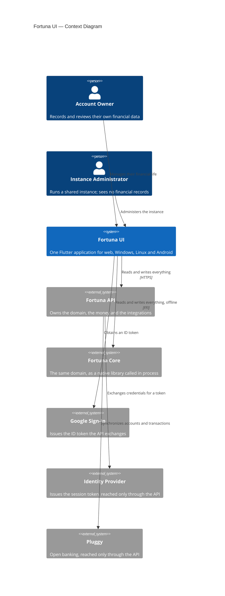
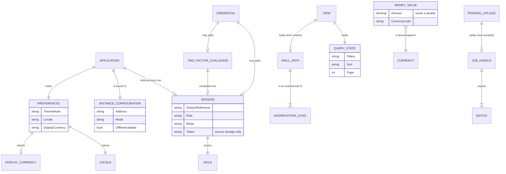
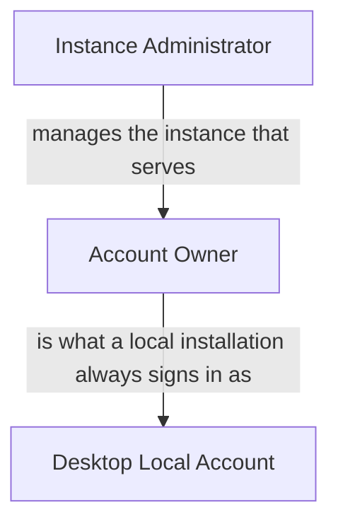

# Vision Document — Fortuna UI

## 1. Introduction

### 1.1 Purpose

This document establishes what Fortuna UI is, who it is for, and what it must do — at altitude,
before any decision about screens, packages or endpoints. Fortuna UI is the client application of
the Fortuna personal finance system: one Flutter code base that runs on the web, Windows, Linux and
Android, and that reads and writes everything through the
[Fortuna API](https://github.com/artur-rios/fortuna-api). The API owns the domain, the money and the
integrations; this application owns the experience of using them. Technology choices and versions
live in the [Technology Stack Document](Technology%20Stack%20Document.md), and are not restated
here.

### 1.2 Scope

**In scope.** Everything a person does with their financial data through an interface: signing in,
recording and reviewing money movement, managing holdings, organizing and planning, bringing data in
from external sources and files, reading it as tables and charts, drilling into an aggregation,
looking at projections, exporting, and exercising their data rights. Also in scope is the
administrative surface an instance administrator uses, and the desktop offline mode that runs with
no network at all.

**Out of scope**, deliberately and permanently:

- **Computing money.** Every balance, total, aggregation and projection is asked of the API. The
  application formats figures; it never derives them.
- **Owning data.** There is no client-side database. Nothing a user enters is authoritative until
  the API has accepted it.
- **Parsing or rendering files.** An import is uploaded whole; an export is produced by the API and
  merely saved.
- **Talking to external services.** Every integration is reached through the API. The single
  exception is Google, which issues a sign-in token the API exchanges.
- **iOS and macOS.** Neither platform is targeted.
- **Offline capability outside desktop offline mode.** A lost connection is reported, never
  disguised by a cache.

The application also inherits every exclusion the API declares: it does not move money, does not
give financial advice, does not do tax filing, does not store bank credentials, and never writes
back to a financial institution.

### 1.3 Definitions and Acronyms

| Term | Definition |
| --- | --- |
| **Account owner** | The everyday user, who owns a set of financial records and sees only their own. |
| **Instance administrator** | Someone who runs a shared instance. Manages it and watches its health, and can never see any user's financial records. |
| **Connected mode** | The normal shape: signed in through the API against the shared identity provider, talking to a remote instance. |
| **Self-hosted mode** | The same experience, pointed at an instance the user runs themselves. |
| **Desktop offline mode** | Windows and Linux only. The installation ships the Fortuna core as a native library and a database, and works with no network. |
| **Fortuna core** | The API's domain and data layers, published as a native library callable in process. The same code that backs the HTTP API. |
| **Transport** | How the application reaches the API — over HTTP, or across the FFI boundary. Invisible above the data layer. |
| **Session** | Who is signed in, in which mode, with what role, and the token that proves it. |
| **Two-factor challenge** | A sign-in accepted but not completed, awaiting a second factor. Grants nothing. |
| **Holding** | A financial account, a credit card or an investment — anything that holds value and has a history. |
| **Money movement** | A transaction, transfer, installment plan or recurring commitment. |
| **Drill-down** | Descending from a chart element into the breakdown behind it, and eventually into individual transactions. |
| **Projection** | A forward-looking figure derived by the API from current data. Never a recorded fact. |
| **Display currency** | The currency the user chooses to read figures in, applied by the API through explicit conversion. |
| **Reference data** | Currencies, categories, accounts, cards, tags and counterparties — small, slow-changing, and the only thing cached. |
| **Job** | An asynchronous API operation — an import, a synchronization, an export — with progress and an outcome. |
| **Consent** | A recorded decision permitting data to reach an external processor, with the version of what was agreed to. |
| **Controller** | Under the GDPR and the LGPD, whoever determines why and how personal data is processed. Which party that is depends on the deployment shape. |

---

## 2. Problem Statement

The Fortuna API already solves the hard half of personal finance: it reconciles data scattered
across bank apps, statement PDFs, broker portals and hand-maintained spreadsheets, and it answers the
two questions that matter — where the money went, and where it is going.

It answers them in JSON. Nobody reads their finances in JSON.

Without a client, the system is unusable by the person it was built for, and every feature the API
implements is a feature nobody can reach. A client that exists on only one platform is barely
better: it recreates the original problem in a new form, where the desktop shows one thing and the
phone another, and the habit of checking never forms because checking is inconvenient. Three
further constraints make this harder than a typical front end. The data is money, so a display error
is not cosmetic. Some of the people who want this run it themselves precisely so that nobody else
holds their financial history, which rules out the usual convenience of a hosted backend and
cloud-based diagnostics. And one of the deployment shapes has no network at all.

---

## 3. Product Position Statement

| Attribute | Description |
| --- | --- |
| **For** | Individuals and households who want a single, trustworthy view of their own money |
| **Who** | Need to see, record and understand their finances on whichever device is in front of them, without handing that history to a service they do not control |
| **The Fortuna UI** | Is a multi-platform client application for the Fortuna personal finance system |
| **That** | Presents a person's whole financial life as tables, charts they can drill into, and forward projections — identically on the web, Windows, Linux and Android, and offline on the desktop |
| **Unlike** | A bank's own app, which sees one institution; a spreadsheet, which sees everything but reconciles nothing; or a hosted aggregator, which sees everything and keeps it |
| **Our product** | Is one interface over a system the user can host themselves, exact about money by construction, and complete enough that no feature requires leaving it |

---

## 4. Stakeholders

| Stakeholder | Role | Concern |
| --- | --- | --- |
| **Account owner** | The everyday user | That their data is complete, exact and private; that entering a transaction is fast enough to become a habit; that a chart answers the question they actually had |
| **Instance administrator** | Runs a shared instance | That the instance is healthy and its users are served — while never being able to read anyone's records, including by accident |
| **Self-hosting owner** | Runs Fortuna for themselves | That the installation is simple, that the desktop package works with nothing else installed, and that nothing phones home |
| **Maintainer** | Builds and maintains this repository and the API | That one code base serves four targets without forking; that the API contract is generated rather than hand-copied; that a use case can be delivered end to end without ambiguity |
| **Data subject** | Any person whose data the system holds — normally the account owner | That consent is asked before anything leaves for a third party, that their data can be taken out whole, and that erasure actually erases |
| **Fortuna API** | The system this client consumes | That its contract is respected: that the client neither recomputes what the API decides nor assumes fields the contract does not carry |

---

## 5. High-Level Architecture

The application has exactly one dependency of its own — the Fortuna API — reached over one of two
transports. Everything else it appears to depend on, it reaches through the API. Google is the only
exception, and only far enough to obtain a token it immediately hands over.

---

## 6. Core Features

| ID | Feature | Description |
| --- | --- | --- |
| **F-01** | Sign in and session | Sign in with credentials or Google, complete a two-factor challenge, sign in to a desktop local account and recover one, sign out. Sign-up is the first Google sign-in. |
| **F-02** | Credential and two-factor management | Recover a password, verify an address, and enable, confirm, disable or re-key two-factor authentication. |
| **F-03** | Instance and mode configuration | Choose which instance to talk to, and run in connected, self-hosted or desktop offline mode. |
| **F-04** | Holdings | Create, view, update and delete financial accounts, credit cards and investments; see balances and positions. |
| **F-05** | Credit card cycles | See a card's billing cycles and statements, close a statement, and settle one from an account. |
| **F-06** | Money movement | Record, search, update and delete transactions; record transfers, installment purchases and recurring commitments; reconcile a transaction. |
| **F-07** | Organization | Manage the category tree, tags and counterparties, and reassign transactions between categories. |
| **F-08** | Planning | Define budgets and goals, and track consumption and progress against them. |
| **F-09** | Ingestion | Consent to external processing, connect an institution, synchronize, reauthenticate and revoke; import an Excel workbook or a statement PDF; follow a job and review what it imported. |
| **F-10** | Attachments | Attach a document to a transaction, download it, and remove it. |
| **F-11** | Spreadsheet view | Read any set of records as a filterable, sortable, paginated grid, with the work done by the API. |
| **F-12** | Charts and drill-down | Read aggregations as charts, and descend from any element into the breakdown behind it, down to the individual transactions and back out. |
| **F-13** | Position and projection | See the net position, forward cash flow projections and committed obligations, always distinguishable from recorded figures. |
| **F-14** | Export | Ask the API for a CSV, Excel or PDF rendering of a data set and save it. |
| **F-15** | Lifecycle and audit | Delete a record, restore it, permanently remove one already deleted, and read the audit trail. |
| **F-16** | Data rights | Give and withdraw consent, take a complete export of everything the system holds, and erase the account. |
| **F-17** | Administration | For an instance administrator: the instance's operational surface and health, and nothing else. |
| **F-18** | Presentation | Choose theme, locale and display currency, and have every figure and date formatted accordingly. |

---

## 7. Domain Model Overview

The financial domain belongs to the API, and this application holds none of it. The model below is
what the *client* owns: the state that makes an interface work.

Three things in this model are load-bearing rather than incidental. **A `MoneyValue` is a decimal
and a currency together** — an amount without its currency is not a value this application will
carry, because a bare number invites the arithmetic `BR-07` forbids. **A `TwoFactorChallenge` is not
a `Session`**, and deliberately holds nothing a session holds; until it completes, the application
is in the same state as signed out. And **`DrillPath` is an ordered trail rather than a current
position**, which is what makes a drill-down reversible instead of a one-way descent.

---

## 8. Roles Hierarchy

| Role | Relationship | Permissions |
| --- | --- | --- |
| **Account owner** | Owns a set of financial records | Everything to do with their own data: holdings, money movement, organization, planning, ingestion, insight, export, lifecycle, audit and data rights. Sees no administrative surface. |
| **Instance administrator** | Runs the instance the owners use | The instance's operational surface and health. **No access to any financial record**, anywhere in the interface — not in a chart, a total, an export, or an error message. |
| **Desktop local account** | An account owner on an offline installation | Exactly the account owner's permissions. No administrative surface exists in an offline installation, because there is no instance to administer. |

The arrow from administrator to owner is authority over the *instance*, not over the data. It is the
one hierarchy in this system that deliberately does not confer read access downward.

---

## 9. Constraints

- **One code base, four targets.** Web, Windows, Linux and Android are served by the same source.
  Platform-specific code is confined to what genuinely differs — file selection and saving, window
  chrome, secure-storage backing, and the availability of offline mode. No iOS, no macOS.
- **The API is the sole authority.** The client renders answers and never derives them. No balance,
  total, aggregation, conversion or projection is computed here.
- **Money is exact, always.** A monetary amount is an exact decimal with its currency, and never
  reaches a binary floating-point type at any layer. The one contact with `double` — plotting a
  chart — is one-way, and the value is never read back from a coordinate.
- **The transport is invisible.** HTTP and FFI are two ways to reach the same core. Nothing above
  the data layer may branch on which is in use.
- **Nothing leaves except to the API.** No analytics, no crash reporting, no telemetry, no
  third-party SDK that observes use.
- **A credential is never persisted**, and a token lives only in the platform's secure storage.
- **The generated code is generated.** The API client and the FFI bindings are produced from the
  API's own published contracts and never hand-edited.
- **The application is compliant with the GDPR and the LGPD.** Consent precedes any disclosure to an
  external processor; a complete export and an account erasure are reachable from the interface. Who
  the **controller** is depends on the deployment: in self-hosted and desktop offline installations
  the user is their own controller, and on a shared instance the operator is — which determines
  whether the application shows a privacy notice and a route for rights requests.
- **Four locales from the first version** — `en-US`, `en-GB`, `en-150` and `pt-BR` — governing
  number, date and currency formatting as much as text.
- The technology that satisfies these constraints is fixed in the
  [Technology Stack Document](Technology%20Stack%20Document.md).

---

## 10. Success Criteria

- **Every API capability is reachable.** Every use case the API exposes has a way into it from the
  interface, and none of them requires knowing an identifier, a route or a payload shape.
- **It is the same application everywhere.** A person moving from the desktop to the phone finds the
  same concepts in the same order, and every feature except desktop offline mode exists on all four
  targets.
- **Money displays exactly.** A figure on screen matches the API's answer to the cent, in the
  currency it belongs to, under every one of the four locales. No monetary value is a `double`
  anywhere in the source, and a test proves it.
- **It feels instant.** Interaction holds 60 frames per second with no frame exceeding 16 ms during
  scrolling and chart animation. A screen backed by a single API read is painted within 100 ms of
  that response arriving. Cold start is under 3 seconds on desktop and under 5 seconds on the web
  over a normal connection.
- **Long work never blocks.** Imports, synchronizations and exports report progress, survive
  navigation away, and remain findable afterwards.
- **A drill-down always resolves.** Every chart element can be descended into, down to the
  individual transactions behind it, and every descent can be reversed.
- **Nothing leaks.** No credential reaches disk, a log or a crash report; no financial data reaches
  any destination but the API; a signed-out application retains nothing about who was signed in.
- **The data rights work.** Consent is recorded before anything reaches a third party, an export
  produces everything the system holds, and an erasure leaves nothing that identifies the user.
- **It installs cleanly on each target.** The web build is served from a container behind a reverse
  proxy; Windows has an installer and a portable archive; Linux has an installer; Android has an
  APK. Each is produced by the same pipeline from the same source, and the desktop packages work
  with nothing else installed.
